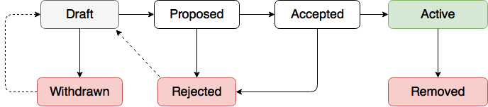

<pre>
  PIP: 1
  Title: PIP Purpose and Guidelines
  Type: Process
  Impact: None
  Author: Herman Schoenfeld &lt;<i>herman@sphere10.com</i>&gt;
  Comments-URI: TBD
  Status: Draft
  Created: 2017-07-24 
</pre>

## Abstract

A PascalCoin Improvement Proposal (PIP) is a design document for introducing features and/or information into PascalCoin.  As of this publication date,  this is the standard way for changes to be introduced into PascalCoin. Anyone can submit a PIP and all PIPs are evaluated through the PIP Workflow.

PIPs are intended to be the primary mechanisms for proposing new features and documenting design decisions. It is the responsibility of the PIP author to document community consensus including dissenting opinions.

## Copyright

This PIP is dual-licensed under the Open Publication License and BSD 2-clause license.

## PIP Workflow
Anyone can author a PIP and submit it to the PIP Maintainer via e-mail or GitHub pull-request. The PIP Maintainer will validate the submission matches the PIP Format, and once corrected, will be added/pulled into the PascalCoin repository. The PIP is then evaluated through the PIP Workflow as follows:

Once the PIP is submitted to the PIP Editor, the PIP editor maintains the status of the PIP as the workflow progresses.

### Consensus

Consensus on a PIP is arrived at by the community and the PascalCoin developers.

### Transferring Ownership

If it becomes necessary to transfer ownership of a PIP, the original author is retained as a co-author and the new author is added to the PIP. This process takes place by the new author sending an email to the PIP Editor, carbon-copying the original author, explaining the transfer. The original author must consent if reasonably able to do so. The PIP Editor can make the decision without the original author.

### PIP Editors

The current PIP editor is Herman Schoenfeld who can be contacted at herman@sphere10.com.

## PIP Format and Structure
A PIP submission should be written in mark-down (GitHub flavor) and consist of the following structure:

 - <b>Header</b> -- Metadata description of the PIP (see below) 
 - <b>Summary</b> -- Short (~200 word) description of the technical issue being addressed
 - <b>Motivation</b> -- Clear explanation of why current protocol is inadequate to address the problem the PIP solves. 
 - <b>Specification</b> -- Full technical description of the proposed new feature, clear enough for i
 - <b>Rationale</b> -- Discussion why was the specification was chosen over alternate designs. Evidence supporting the specification should be provided here, as well as community concerns and consensus.
 - <b>Backwards Compatibility</b> -- Any backwards incompatibilities should be described here, as well as work-arounds/solutions for these incompatibilities.
 - <b>Reference Implementation</b> -- The reference implementation must be provided before PIP is Completed.
 - <b>Links</b> -- references and links to relevant material

PIP editors can use [this online editor](https://jbt.github.io/markdown-editor/) for editing and/or previewing their PIP submission.

### Header 

<pre>
  PIP: &lt;<i>PIP number, or "?" before being assigned</i>&gt;
  Title: &lt;<i>PIP title; maximum 44 characters</i>&gt;
  Type &lt;<i>The type of PIP, see below for options</i>&gt;
  Author: &lt;<i>list of authors' real names and email addrs</i>&gt;
  Impact &lt;<i>How impactful the proposed changes are, see below for details.</i>&gt;
* Discussions-To: &lt;<i>email address</i>&gt;
* Comments-Summary: &lt;<i>summary tone</i>&gt;
  Comments-URI: &lt;<i>links to wiki page for comments</i>
  Status: &lt;<i>Workflow status, see above</i>&gt;
  Type: &lt;<i>Standards Track | Informational | Process</i>&gt;
  Created: &lt;<i>date created on, in ISO 8601 (yyyy-mm-dd) format</i>&gt;
* Requires: &lt;<i>PIP number(s)</i>&gt;
* Replaces: &lt;<i>PIP number</i>&gt;
* Superseded-By: &lt;<i>PIP number</i>&gt;
</pre>

* are optional fields.

#### PIP Types

| PIP Type       | Description |
| :------------- | :-----------|
| Protocol       | Changes to the network protocol relating to Blocks, Operations and the  SafeBox. |
| Backend        | Changes to the JSON RPC-API, Daemon or implementation-level concern such as storage, etc |
| Frontend       | Changes to the the wallet including GUI, UX, JSON-RPC etc
| Informational  | Design issues, general guidelines. Does not require PIP consensus, informational only | 
| Process        | Describes change in PIP process. |

A PIP may have multiple types. 

#### Impact Severity

| Impact        | Description                      |
| :------------ | :------------------------------- |
| None          | can be implemented without impacting network |
| Soft-Fork     | changes can be deployed as an optional upgrade whilst retaining backwards compatibility with non-upgraded nodes. |
| Hard-Fork     | changes require a scheduled network-wide upgrade whereby non-upgraded nodes will not inter-operate with upgraded nodes. |

#### Affected Aspects

| Aspect     | Description                                       |
| :--------- | :------------------------------------------------ |
| Protocol   | changes to the PascalCoin network protocol        |
| API        | changes to JSON-RPC API                           |
| GUI        | changes to wallet GUI                             |
| Mobile     | changes to mobile GUI or implementation           |
| Other      | changes to any other aspect of how PascalCoin is implemented. For examples, changes to log format or how persistence-layer would fall other here. |

