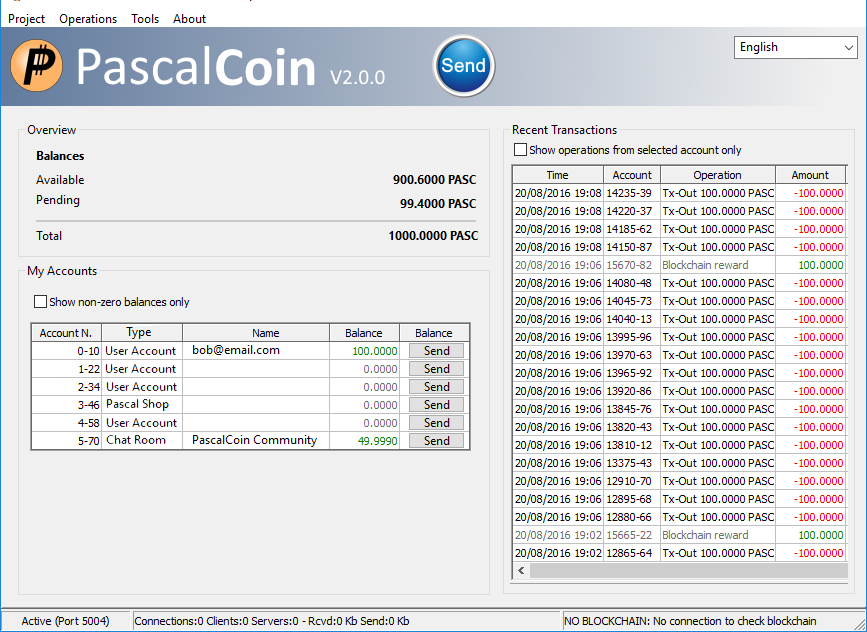
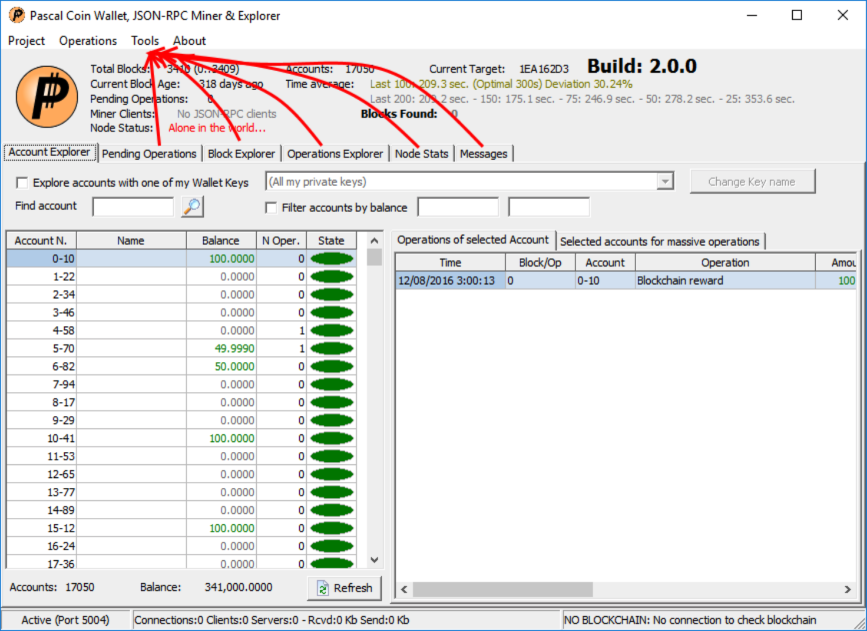

<pre>
  PIP: 7
  Title: New Wallet GUI
  Type: Front-End
  Impact: None
  Author: Herman Schoenfeld <i>&lt;herman@sphere10.com&gt;</i>
  Comments-URI: <a href="https://github.com/PascalCoin/PascalCoin/issues/47">https://github.com/PascalCoin/PascalCoin/issues/47</a>
  Status: Draft
  Created: 2017-07-20
</pre>

## Summary

Whilst fully functionality, PascalCoin's wallet GUI is overly complicated for most users and requires simplification. This PIP proposes a new wallet design.
 
## Motivation

Community consensus is that current wallet GUI is overly complicated and impedes adoption. Users have also requested translations into other languages. Before investing in new wallet features, a new design is warranted. 

## Specification

#### Main Screen
The main screen should be similar to the familiar Bitcoin QT wallet screen

The tabs from existing screen should should be moved into independent screens, available from a `Tools` menu option.

##### PASA Facuet Integration
First-time users will be able to attain a PASA for free as follows:
- When no accounts are present in the system, the screen shows a button `Get First Account`
- When button is pressed, a dialog is presented to the user to select which key to use. 
- A request is then made to the PASA Faucet Service which dispenses a PASA asset to the selected key.
    + Appropriate protection must be added to prevent scammers depleting faucet (email workflow or other info TBD)

#### Private Keys Screen
The private keys screen should be refactored as follows:
- Always obfuscate entered passwords with password character
- Never display private keys openly
- Utilise QR codes for importing and exporting of keys
- Simplified UX

#### Default Keys 
The following keys should be created on default:
- Public Accounts: used for publically receiving/sending funds
- Private Accounts: used for privately storing savings
- Shared Accounts: accounts shared between devices, parties
- Company Accounts: accounts used for business purposes
- Mining Accounts: accounts used for mining purposes
 
## Rationale

Free Pascal based wallet is chosen since it allows almost all existing code to be salvaged and retains cross-platform capability. Leveraging one of Pascal's benefits is an asset since we do not need complex and long-winded HTML based rich-client, as many other cryptocurrencies are doing.

## Reference Implementation

This PIP has being implemented by Herman Schoenfeld.

## Backwards Compatibility

All changes are fully backwards compatible.
 