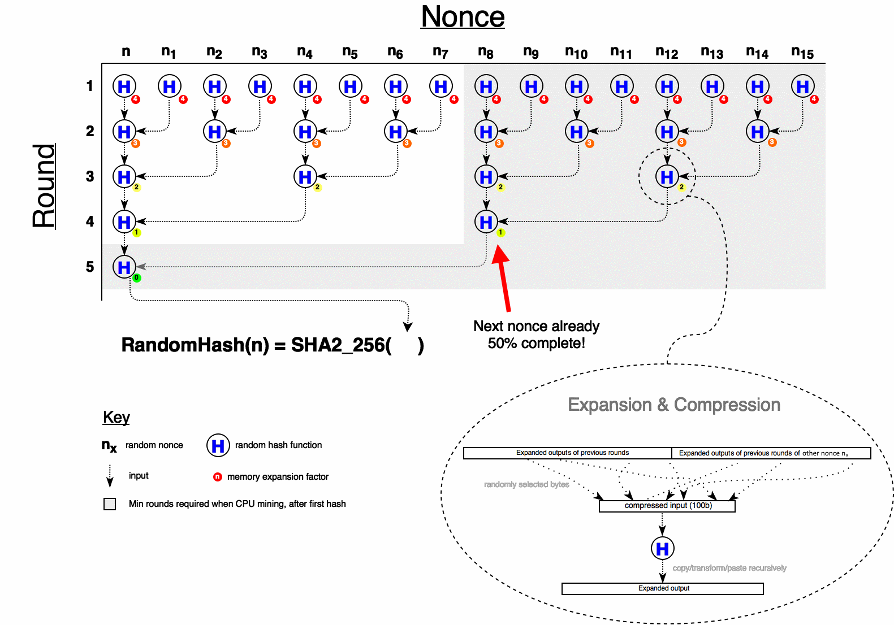

<pre>
  PIP: PIP-0009
  Title: RandomHash: GPU & ASIC Resistant Hash Algorithm
  Type: Protocol
  Impact: Hard-Fork
  Author: Herman Schoenfeld <i>&lt;herman@sphere10.com&gt;</i>
  Comments-URI: https://discord.gg/sJqcgtD  (channel #pip-0009)
  Status: Proposed
  Created: 2017-12-17
  Updated: 2017-12-29 (rev2), 2018-01-01 (typos)
</pre>

## Summary

A GPU and ASIC resistant hashing algorithm change is proposed in order to resolve the current mining centralization situation and to prevent future dual-mining centralization.

## Motivation

PascalCoin is currently experiencing 99% mining centralization by a single pool which has severely impacted ecosystem growth and adoption. Exchanges are reticent to list PASC due to the risk of double-spend attacks and infrastructure providers are reticent to invest due to low-volume and stunted price-growth. 

### Background
PascalCoin is a 100% original Proof-of-Work coin offering a unique value proposition focused on scalability. After the initial launch, a healthy decentralized mining community emerged and became active in the coins ecosystem, as expected. However, after 9 months a single pool (herein referred to as Pool-X) managed to centralize mining over a short period of time. At the time, it was believed that a technical exploit was being employed by Pool-X, but this possibility was ruled out after exhaustive analysis and review by the developers and 3rd parties. It is now understood why and how this centralization occurred, and how it can be fixed.

**It’s an economics issue, not a technical issue**. Since PascalCoin is GPU-friendly PoW coin, it has become a prime candidate for "dual-miners", especially Ethereum-centric Pool-X. Dual-miners are miners who mine two independent coins simultaneously using the same electricity. This works because some coins are memory-hard (Ethereum) and others are not (PascalCoin). When mining memory-hard coins, GPUs have an abundance of idle computational power which can be re-purposed to simultaneously mine a non-memory-hard coin like PascalCoin. Whilst a great technical innovation, the introduction of dual-mining has fundamentally changed the economics and incentive-model of mining for the "secondary coin". 

Ordinarily, a coins mining ecosystem grows organically with interest and centralization does not occur. This is due to the "hash-power follows price" law. As price grows organically due to interest, so do the number of miners. If there are too many miners, the coin becomes unprofitable, and some miners leave. This homeostasis between mining, price and ecosystem size is part of the economic formula that makes cryptocurrencies work.

With dual-mining, this is broken. Dual-mining has led to coins with small user-base to have totally disproportionate number of miners who mine the coin even when "unprofitable". In the case of PascalCoin, miners are primarily on Pool-X to mine Ethereum, not PascalCoin. So the number of PascalCoin miners are a reflection of Ethereum's ecosystem, not PascalCoin's. Also, these miners mine PascalCoin because they have latent computing power, so it technically costs them nothing to mine PascalCoin. As a result, they mine PascalCoin even when it's unprofitable thus forcing out ordinary miners who are not dual-mining. 

**These mis-aligned economic incentives result in a rapid convergence to 99% centralization, even though no actor is malicious.**

## Specification

A low-memory, GPU and ASIC-resistant hash algorithm called **Random Hash** is proposed to resolve and prevent dual-mining centralization. Random Hash, defined first here, is a "high-level cryptographic hash" algorithm that combines other well-known hash primitives in a highly serial manner. The distinguishing feature is that calculations for a nonce are dependent on partial calculations of other nonces, selected at random. This allows a serial hasher (CPU) to re-use these partial calculations in subsequent nonce-mining saving 50% or more of the work-load. Parallel hashers (GPU) cannot benefit from this optimization since the optimal nonce-set cannot be pre-calculated as it is determined on-the-fly. As a result, parallel hashers (GPU) are required to perform the full workload for every nonce. Also, the algorithm results in 10x memory bloat for a parallel implementation. In addition to it's serial nature, it is branch-heavy and recursive making in optimal for CPU-only mining.

### Overview

1. Hashing a nonce requires ```N``` iterations (called rounds)
2. Each round selects a random hash function from a set of 16 well-known hash algorithms
3. The input at round ```x``` depends on the output from round ```x-1```
4. The input at round ```x``` depends on the output from another previous round ```1..x-1```, randomly selected
5. The input at round x depends on the output from round ```x-1``` **of a different nonce**
6. The input at round ```x``` is a compression of (3), (4) and (5) to ```100 bytes```.
7. The output of every round is expanded for memory-hardness
8. Randomness is generated using ```Mersenne Twister``` algorithm
9. Randomness is seeded via ```MurMur3``` checksum of previous round
10. The final round is then hashed again via ```SHA2_256```, in keeping with traditional cryptocurrency approaches.

### RandomHash Design


 
### RandomHash pseudo-code
```pascal
    const
        HASH_ALGO = [
            SHA2_256
            SHA2_384
            SHA2_512
            SHA3,
            RIPEMD160,
            RIPEMD256,
            RIPEMD320,
            Blake2b, 
            Blake2s,
            Tiger2,
            Snerfu,
            Grindahl512,
            Haval,
            MD5
            RadioGatun32
            Whirlpool
        ]
        N = 5           // Number of hashing rounds required to compute a nonce (total rounds = 2^N - 1)
        M = 10KB        // The memory expansion unit (in bytes)

        Function RandomHash(blockHeader : ByteArray)
        begin               
            Result := SHA2_256( RandomHash( blockHeader, N) )
        end

        Function RandomHash(blockHeader : ByteArray, Round : Integer) : ByteArray
        begin
            let RoundOutputs = array [1..Round] of RawBytes;
            let seed = Checksum(blockHeader)
            let gen = RandomNumberGenerator(seed)
            let input = blockHeader
            
            for i = 1 to Round do 
                let random = gen.NextDWord
                let hashFunc = HASH_ALGO[random % 16]                
                if i = 1 then
                    let input = blockHeader
                else
                    let prevRound = RoundOutputs[i - 1]
                    let randPrevRound = RoundOutputs[ random % (i - 1) + 1 ]
                    let otherNonceHeader = ChangeNonce(blockHeader, random)
                    let otherNonceRound = RandomHash(otherNonceBlockHeader, i - 1)
                    let input = Compress(prevRound, randPrevRound, otherNonceRound, gen)
                let output = hashFunc(input)                
                output = Expand( output, N - i, gen )
                gen.Seed = Checksum(output)                
                RoundOutputs[i] = output 

            Result = RoundOutputs[Round]
        end


        function Expand(input : ByteArray, ExpansionFactor : Integer, gen : RandomNumberGenerator) : ByteArray
        begin
            let Size = Length(randomBytes) + ExpansionFactor*M;
            let output = input.Clone
            let bytesToAdd = Size - Length(RandomBytes)
            while output < Size do
                let nextChunk = output.Clone
                if Length(output) + Length(nextChunk) > Size then
                    SetLength(nextChunk, Size - Length(output))

                let random = gen.NextDWord
                case random % 8 do
                    0: output = output ++ MemTransform1(nextChunk)
                    1: output = output ++ MemTransform2(nextChunk)
                                .
                                .
                                .
                    7: output = output ++ MemTransform8(nextChunk)

            Result = output
        end

        function Compress(input1, input2, input3 : ByteArray, gen : RandomNumberGenerator) : ByteArray
        begin
            let output = ByteArray[0..99]

            for i = 0 to 99 do
                var random = gen.NextDWord
                case random % 3 do
                    0: let source = input1
                    1: let source = input2
                    2: let source = input3
                output[i] = source[random % Length(source)]

            Result = output
        end 

        function ChangeNonce(blockHeader : ByteArray, nonce : Integer) : ByteArray
        begin
            // changes nonce in blockHeader by knowing offset of nonce
        end


        Function Checksum(input : ByteArray) : DWord
        begin
            // standard MurMu3 algorithm
        end

        Function RandomNumberGenerator(seed : DWord) : TMersenneTwister
            // standard Mersenne Twister random number generator (or other suitably chosen algorithm)
        end;
```

#### Memory transform methods

These methods are iteratively and randomly applied to a hash output in order to rapidly expand it to M bytes
```
     - Method 1: No-Op         (e.g. input = 123456   output = 123456)
     - Method 2: Swap-LR       (e.g. input = 123456   output = 456123)   
     - Method 3: Reverse       (e.g. input = 123456   output = 654321)  
     - Method 4: L-Interleave  (e.g. input = 123456   output = 142536)
     - Method 5: R-Interleave  (e.g. input = 123456   output = 415263)
     - Method 6: L-XOR         (e.g. input = 123456   output = XOR(1,2), XOR(3,4), XOR(5,6), XOR(1,6), XOR(2,5), XOR(3,4)
     - Method 7: ROL-ladder    (e.g. input = ABCDEF   output = ROL(A, 0), ROL(B, 1), ... , ROL(F, 5)
     - Method 8: ROR-ladder    (e.g. input = ABCDEF   output = ROR(A, 0), ROR(B, 1), ... , ROR(F, 5)
```

### RandomHash Analysis

#### CPU Bias

The RandomHash algorithm is inherently biased towards CPU mining due to it's highly serial nature. In addition, RandomHash allows CPU miners to cache the partial calculations of the other nonces and resume them later. This allows CPU miners to save 50% of the work during mining. This is formally proven below, but is easy to grasp as follows - in order to complete a nonce to round ```N```, another nonce needed to be completed to round ```N-1```. The other nonce requires 1 more round to complete, saving 50% of the work. This optimal nonce-set cannot be pre-calculated, and can only be enumerated. As a result, serial mining (CPU) does 50% the work of parallel mining (GPU).

#### Memory Complexity

RandomHash is memory-light in order to support low-end hardware.  A CPU will only need 1MB of memory to verify a hash. During mining, it will need 2MB (if it intends to utilize 50% bias mentioned above) - an easy requirement. It's important to note that RandomHash consumes most of the memory in the initial rounds and little in the final rounds. This is deliberate in order to hinder GPU mining.  For example, suppose a GPU has 1GB of memory. A naive hasher could attempt to batch 1000 nonces since each nonce only requires 1MB. However, since each nonce depends on 15 other nonces and most of the 1MB is consumed in the early rounds, the GPU will run out of memory quickly. The batch size needs to be divided by 15 in order to utilize 1GB which  means most of the GPU memory is wasted partial-nonce calculations. The GPU could only effectively compute 100 nonces per 1GB. Note, a CPU could easily compete with this memory requirement and implement intelligent parallel mining (by using other threads to mine less-partially calculated nonces). This would give a CPU >> 50% advantange, but needs further research.

#### GPU Resistance 

GPU performance is generally driven by parallel execution of identical non-branching code-blocks across private regions of memory. Due to the inter-dependence on of hashing rounds, the slower global memory will need to be used. Also, due to the highly serial nature of RandomHash's algorithm, GPU implementations will be inherently inefficient. In addition, the use of Mersenne Twister to generate random numbers and the use of recursion will result in executive decision making further degrading GPU performance.  Most importantly, since nonce's are inter-dependent on other random nonces, attempts to buffer many nonces for batch hashing will result in high memory-wastage and 200% more work than a CPU. This occurs because each buffered nonce will require calculation of many other non-buffered nonces, rapidly consuming the available memory. A CPU implementation does not suffer this since the optimal nonce-set to mine are always the previous random nonces it's already partially calculated. Another important feature is the pattern of memory expansion factors chosen for each round. These were deliberately chosen to hinder GPUs by amplifying the memory needed for their wasted calculations.

As a result, it's expected that GPU performance will at best never exceed CPU performance or at worst perform linearly better (not exponentially as is the case now).

#### ASIC Resistance 

ASIC-resistance is fundamentally achieved on an economic basis. Since 16 hash algorithms are employed the R&D costs of a RandomHash ASIC are equivalent to that of 16 ordinary mining ASICS. Furthermore, due to the non-deterministic branching and executive decision making arising from Mersenne Twister, expansion and contraction, an ASIC implementation will inevitably result in dense highly inter-connected cells, impacting performance. It is the opinion of the author that such an ASIC design would, in some ways, require "re-creating a CPU" inside the ASIC, defeating its purpose. However, fundamentally it is expected that since the costs to develop will far exceed the ROI, no rational economic actor will undertake ASIC development of RandomHash.

#### RandomHash Variations

Variations of RandomHash can be made by varying N (the number of rounds required) and M (the memory expansion). For non-blockchain applications, the dependence on other nonces can be removed, providing a cryptographically secure general-purpose, albeit slow, secure hasher.

It is also possible to change the depdendence graph between nonces. For example, requiring the initial rounds to depend on more than one nonce and the higher rounds on no nonces at all, could allow further CPU vs GPU optimization. Similarly, for memory expansion factors.

### Formal Proofs

This section proves some of the claims made in this PIP. 

Let ```N``` = the number of rounds required to complete a single RandomHash

Let ```M``` = the memory unit to expand out a hash's output by


#### Hash Complexity

Let ```F(x)``` denote number of hashes required at round ```x```.

Since the first round just hashes the block header, the base case for ```F``` is
```
    F(1) = 1
```
Since a hash at round x is the hash of the previous round **and** of round ```x-1``` of another nonce
```
    F(x) = 1 + F(x-1) + F(x-1)  
```

Simplifying
```
    F(x) = 1 + 2 F(x-1) 
         = 1 + 2(1 + 2 F(x-2)) 
         = 1 + 2^1 + 2^2 + 2^3 + ... + 2^(x-1)
         = SUM(i=0, x-1) 2^i
         = 2^x - 1
```

Thus
```
    F(x) = 2^x - 1
```

#### Memory Consumption

Let ```G(N)``` denote the minimum amount of memory required for a RandomHash of a single nonce. Here ```N``` denotes the number of rounds required in RandomHash.

Firstly, after a full RandomHash involving ```N``` rounds, the total count of hashes at any round ```x``` is
```
    TotalHashesAtRound(x) = 2^(N-x)     
```

**NOTE**: Use above [diagram](#randomhash-design) to visualize and understand this. 
 - pick any row ```x```
 - count horizontally 
 - note that ```N=5``` in the [diagram](#randomhash-design)

It follows that the total memory for the round is calculated as follows
```
    TotalMemoryAtRound(x) = (N-x) * TotalHashesAtRound(x)
                          = 2^(N-x) * (N-x)
```
This can be seen by observing the memory-expansion factors in the diagram. Notice it starts at ```N-1``` for the first round and decrease every subsequent round. 

The total memory, ```G(N)``` is simply the sum of all the memory at each round
```
    G(N) = sum(i=1, N) TotalMemoryAtRound(i)
         = sum(i=1, N) 2^(N-i) * (N-i)
         = 2^N (N-2) + 2
```

Thus,
```
    G(N) = 2^N (N-2) + 2
```

**NOTE**: For PascalCoin ```N=5``` which means ```98``` units of memory are required for a single nonce. Choosing memory unit ```M=10kb``` means that approximately ```1MB``` will be required. Quite low for a CPU, but bloats quickly for a GPU as mentioned below.

#### CPU Bias

To show that CPU does 50% the hashing work of a GPU consider that
 - N rounds are required to trial a single nonce 
 - After the completion of any nonce, another nonce is known and computed to round ```N-1```
 - Almost all nonce computations resume the previous ```N-1``` nonce, requiring onlY ```F(N-1)``` work. This is true for serial mining (CPU), not for parallel mining (GPU)

Thus the work a CPU does is
 
    CPU Work = F(N-1) 
             = 2^(n-1) - 1

However GPU does the entire work for every nonce

    GPU Work = F(N)
             = 2^n - 1

The efficiency is thus

    Efficiency = (CPU Work) / (GPU Work)
               = (2^(N-1)-1) / (2^N - 1)

Taking the limit as N approaches +inf
                = 0.5

Thus a CPU does 50% the work of a GPU.


### Hard-Fork Activation

The PIP requires a hard-fork activation involving various aspects discussed below.

#### Consensus

Since this is a significant change, the PascalCoin community will be asked to vote on this proposal by changing their account types to numbers which correspond to YES or NO votes respectively. All other numbers will be considered ABSTAIN. The total PASC and PASA will be tallied.

    Example:
        Account 9876-54 with 0 PASC is considered 1 votes
        Account 1234-56 with 100 PASC is considered 101 votes

#### Implementation

If after a period of time and consensus is reached, RandomHash will be merged into the PascalCoin code-base by the PascalCoin developers. After thorough testing on TestNet, a suitable activation date will be chosen to allow ecosystem to adopt this mandatory upgrade. A release will be made and notifications provided of activation within the time-frame.

#### Difficulty Reset

On activation, the block difficulty will be reset to an appropriately low value. During this period, he block time will be highly unstable but quickly stabilize over approximately 200 blocks. Exchanges are recommended to pause deposits and withdrawals 1 hour before activation and 10 hours after.

## Rationale

Aside from a hash algorithm change, the only other known option to resolve 99% mining centralization is to encourage other large Ethereum mining pools to also offer PascalCoin dual-mining. Even if this were achieved, it would still price-out ordinary pools and solo-miners, which is undesirable. Efforts to encourage other dual-miners were undertaken but have failed. As a result, this option is no longer considered viable. Changing the hash algorithm is now the only known option to resolve centralization.

Within the scope of changing hash algorithm, other possible hash algorithms like Equihash were considered. However, these were ruled out due to their excessive memory consumption contradicting. PascalCoin's requirements to run on low-end hardware without voluminous amounts of fast memory available to validate block hashes.

## Backwards Compatibility

This PIP is not backwards compatible and requires a hard-fork activation. Previous hashing algorithm must be retained in order to validate blocks mined prior to the hard-fork.
 
## Reference Implementation

A reference implementation will be provided in the coming weeks.
 
## Links

1. [Mersennne Twister Implementation (Lazarus/FPC)][1]
2. [MurMur3 Implementation (Lazarus/FPC)][2]

[1]: http://wiki.freepascal.org/A_simple_implementation_of_the_Mersenne_twister
[2]: https://github.com/Xor-el/HashLib4Pascal/blob/master/HashLib/src/Hash32/HlpMurmurHash3_x86_32.pas 
