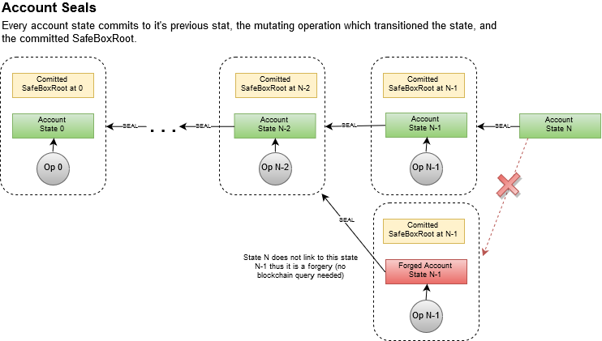
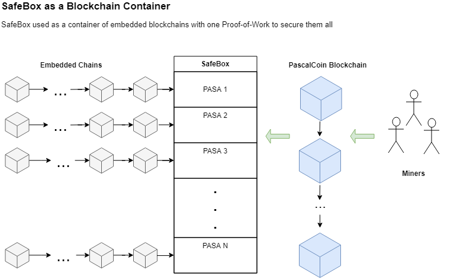

<pre>
  PIP: PIP-0029
  Title: Account Seals: Cryptographically Secure Account Histories  
  Type: Protocol
  Impact: Hard-Fork
  Author: Herman Schoenfeld <herman@sphere10.com>  
  Copyright: Herman Schoenfeld, 2019 (All Rights Reserved)
  License: GNU Public License 
  Comments-URI: https://discord.gg/sJqcgtD  (channel #pip-0029)
  Status: Proposed
  Created: 2019-03-29
</pre>

## Summary

It is proposed to enable PascalCoin account histories to be cryptographically secured and independently verifiable without needing the blockchain. This fundamental innovation to the SafeBox-model yields astonishing results and opens the door to new use-cases just not possible on UTXO blockchains and DAGs.



## Motivation

PascalCoin currently allows users to own accounts (PASA) and send/receive operations between those accounts. These accounts are stored in the SafeBox and their states are mutated by operations. These operations are contained within blocks which applied to the SafeBox in an [ACID][3] manner.

Operations in PascalCoin mutate account states in various ways (e.g. balance, name, key, data, etc) and follow strict consensus rules enforced by all nodes. Every time an account state is changed, it's prior state is lost from the SafeBox. Much in the same way that an individuals bank account history of transactions is important and useful, the history of PASA states (and transitions) is likewise fundamentally important and useful. However, since PascalCoin nodes only need/keep the last 100 blocks, the account history after 100 blocks is essentially lost (not currently the case, but expected in a global adoption scenario).

In order to know more than 100 blocks of history, the user must track these operations manually, or request them from an archival node. A dilemma arises here in that without the blockchain, there is no way for the user to determine if the history is forged, corrupt, invalid or valid. The user is left with a trust-model. In a trust-free scenario, such a history is essentially useless since no decision can be made by any decentralized party as the history has no intrinsic security. Only the blockchain can validate the history, and this is impractical in global adoption scenario where the full blockchain is beyond storage of an ordinary node.

This PIP proposes a small upgrade to the account structure and all operation mutation rules so that the resulting account history is made cryptographically verifiable and intrinsically secure. With this feature, a user would only require the current SafeBox to verify an accounts history, **not** the blockchain. This is achieved by including a hash-based link between PASA state-transitions, much in the same way to how blocks link in a blockchain.
This link, called the Account Seal (or PASA Seal) is simply a hash commitment to the accounts prior state and the mutating operation which led to the current state. This seal is a 20-byte field within the Account itself.

Since each state links to the prior state, and that prior state links to it's prior state, an Account Seal commits to the entire preceding history of that account. Therefore, a user possessing an account history can easily validate that the history is valid by re-calculating the seals in chronological order ensuring the final seal matches the current SafeBox seal. 

This opens the door to the following use-cases:

### PASA as a Decentralized Consensus-Ledger

Since a PASA history of state-transitions, and the set of operations which created that history, can be independently verified by an individual node, the history can be re-purposed by users as a decentralized-consensus ledger.

Under this interpretation, a PASA history becomes a ledger of chronologically ordered statements made by parties of a contract which cannot be forged, altered or tampered with by those parties. Should a dispute arise between the parties, an arbitrating party can independently retreieve the ledger and cryptographically verify it. No trusted 3rd parties or notaries are required whatsoever.

Such a ledger lends itself to many use-cases including:
- Proof-of-Audit solutions between adversarial parties (i.e. consortiums of competitors, or enforcing treaties between adversarial governments)
- Supply-chain notarization solutions 
- Version-control system for documentation and manufacturing
- Any legal-contract execution work-flow

### PASA as an Embedded-Chain

Since each account state links to it's previous state similar to how blocks link in a blockchain, accounts can be used to secure "embedded side-chains" (or **embedded-chains** for short). 

Under this interpretation, the chain of account states (or a PASA-Chain) is used to embed a blockchain that is then consumed by participants of layer-2 network to determine a common consensus between themselves for a layer-2 application, in a trust-less and decentralised manner. Since the ledger of messages is reliable, layer-2 nodes need only process the messages that comply with layer-2 consensus rules and ignore the ones that don't. All layer-2 nodes will always remain in consensus with each other, yet be independent of each other, since they only depend on the validity of the track of messages stored in the PASA-Chain.

With this change, the SafeBox becomes a **Blockchain Container** capable of securing millions of blockchains (1 for each account) where one Proof-of-Work secures them all.  An astonishing result, and the first of it's kind for any cryptocurrency. 



See [Embedded Chain Specification](#embedded-chain-specification) for more details.

### PASA as a Decentralized Finite-State-Machine

With the introduction of [DATA operations][4] in V4, a historical sequence of DATA operations can serve as a state-transition audit-log of any programmatic work-flow.

For example:
- **Decentralized Voting**: Account history used to tally votes such that decentralized consensus is always achieved.
- **Tokens**: Account history used as financial ledger entries of a token issuance, token burns & token transfers. Any protocol-complying wallet can tally all token balances from the history independently of any other wallet. Network always arrives to uniform consensus yet totally decentralized.
- **Decentralized Poker**: Account history serves as sequence of player actions in a poker game, where consensus on the winners/losers is uniformly derived in a total decentralized manner.
- **Decentralized Exchange**: Account history serves as a ledger of user deposits/withdrawals on a DEX, used by Layer-2 network to make decisions on other blockchains.

From an abstracted perspective, under this interpretation, a PASA history can serve as a state-transition log for **any** finite-state-machine (FSM), where the "current state" of the FSM can be determined by any party, independently, securely with uniform network-wide consensus. 

Since almost anything and everything can be modeled as an FSM, in combination with PascalCoin's next-generation scaling and throughput capabilities, this feature serves as a foundation for next-generation Layer-2 smart-contracts and dapps (that scale).

### Light-wallet Full Account History

In addition to the above benefits, more mundane benefit includes ability for mobile-wallets and light-clients to:
- Retrieve account history from any untrusted peer and independently verify correctness.
- Not require any blocks whatsoever, only the SafeBox and PASA history for accounts they care about.
- Dramatical UX improvement in a global-adoption scenario.


### Long-term solution for "State-Attack"

As outlined in the WhitePaper, SafeBox introduces a new attack vector called State-Attack which enables an attacker to forge a SafeBox with invalid account data "before last 100 blocks". Although this attack requires tremendous hash-power and is not feasible with current network (due to archival and long-history nodes that can easily thwart this attack), it could pose an issue in a global adoption scenario (even if for causing short-lived/local SafeBox disruptions).

With this PIP, a PASA history could be used to detect forgeries and thwart a State-Attack. Current block/SafeBox validation work-flow would require some alternation, but conceivably, Account Seals validation can compliment existing Proof-of-Work validation when deciding on valid SafeBox.

Since this is not a concern now, nor will it be until far into the future, the investigation and development of this feature is relegated to a future PIP.

## Specification


### Account Seal Field

The following field is added to the Account record, a 20-byte SEAL.

```
Account = record
   ...
   Seal: array[0..19] of Byte;
   ...
end;
```

### Account Seal Calculation

When an Account A is mutated by an operation O, the following rule must be applied **before** the mutation:

```
A.Seal = HASH( AccountToRawBytes( A ) ++ OPID(O) )
       where              
             HASH( X ) = RIPEMD160( SHA2_256 ( X ) )
             AccountToRawBytes ( X ) = account X serialized as an LE byte array as per network protocol
             OPID(X) = RIPEMD160( operation X serialized as an LE byte array as per network protocol )
```

This rule ensures that whenever an account A is updated by an operation O, the resulting state of A contains a hash commitment to it's previous state and the operation O used to mutate that previous state. Since each Seal transitively commits to prior Seal, each Seal commits to it's entire history.

**NOTE:** The OPID is the equivalent of TXID in Bitcoin, and can be easily extracted from the OPHASH as per below:

```
OPHASH = [BLOCK NUMBER] ++ [SIGNER ACCOUNT] ++ [N_OPERATION] ++ [OPID]
       where
             BLOCK NUMBER: (4 bytes) - the operation is stored in
             SIGNER ACCOUNT: (4 bytes) - the account number of signer (this pays the fee, and may have same key as the “sender” field of operation)
             N_OPERATION: (4 bytes) - the n_operation of signer account when this operation was authored (this increases by 1 for each created operation)
             OPID: (20 bytes) - the RIPEMD160 of RAW OPERATION DATA this is the equivalent of a TXID in Bitcoin). 
```

### Seal Proofs 

In order to prove an prior account state is valid, the user needs a copy of that account state, and a list of hash-pairs from that state to the current state.

```pascal
   TStateProof = record
      AccountState : TAccount;
      OPID : TBytes[20]
   end;

   TAccountProof = array of StateProof;

   function IsValidAccountProof(Proof : TAccountProof) : Boolean;
   begin
      if (proof[Length(proof) - 1].AccountState = SafeBox.GetAccount(account.Number)) AND IsValidProofChain(Proof) then
         return true;
      return false;
   end

   function IsValidProofChain( Proof : TAccountProof ) : Boolean;
   begin
      // validate in reverse
     for i := Length(proof) - 1 downto 1 do begin
        if proof[i].AccountState.Seal <> CalculateSeal( proof[i - 1] ) then
           return false;  // proof invalid at i - 1 
     end
     return true;    
   end;
   
   function CalculateSeal( proofLink : TStateProof ) : TBytes[32]
   begin
      return RIPEMD160 ( SHA2_256 ( Array.Join( SerializeAccount ( proofLink.AccountState ) , proofLink.OPID  ) ) );
   end

   function SerializeAccount(account : TAccount) : TBytes;
   begin 
     return ...; // as per network protocol
   end
```

### Embedded-Chain Specification

There are many methods to embed a blockchain inside a PASA chain, the general idea is to store the block-header and it's content-root inside the operation (or account state) and to depend on the Account Seal as the "chain mechanism".

In particular, by tracking an account state A and it's mutating operation O, an embedded blockchain can be defined as follows:

1. (A, O) = an embedded block
2. A.Seal = pointer to previous embedded block
3. O.Data = block-header (contains merkle-root for (4))
4. Block contents distributed on layer-2 network

Some differences between embedded-chains vs traditional blockchain are:
* embedded chains never fork and are guaranteed to be linear 
* embedded blocks can are not mined, they are created by anyone willing to pay the network fee
* embedded blocks can be created reliably at high-frequency without orphan rate risk
* embedded chains can contain invalid blocks but these are only **ignored** by the layer-2 nodes, not orphaned
* embedded chains do not store any block data, only a hash commitment to the block data which is distributed separately
* embedded chains are validated purely by layer-2 consensus rules
* embedded chains do not require any Proof-of-Work or Proof-of-Stake, they are secured by Layer-1 proof-of-work and carry the same security

#### Spam Attack 

Embedded chains are susceptible to "spam-attack" scenario where a malicious actor attempts to flood the embedded-chain with invalid blocks (at cost). This attack would simply comprise of sending many operations to the target account that are not "valid layer-2 embedded blocks", but which alter the account state nonetheless. This is not a major concern if layer-2 nodes have a mechanism to rapidly detect and reject such invalid layer-1 operations / layer-2 embedded blocks. Although this is a concern for layer-2 protocol designers specifically, general solution approaches include:
1. Use of data operations for declaring embedded blocks, allowing rapid filtering of other unrelated operations/transactions.
2. Use of ```Type``` and ```Sequence``` fields in the Data operation for rapid filtering and validation. 

Both (1) and (2) basically solves for unintentional/accidental spam scenario. For malicious spam-attacks,

3. Bootstrap layer-2 block content with self-verifying merkle-proofs that can be used for on-the-fly error detection and block rejection of (large) invalid blocks. Such approaches are also applicable to "big block attack" scenarios in traditional UTXO blockchains.

## Rationale

Simple and powerful extension that yields tremendous value, for virtually no cost. No brainer update.

## Backwards Compatibility

This change is not backwards compatible and requires a hard-fork activation. On activation, all existing account seals should be defaulted to value ```0x0000000000000000000000000000000000000000```.
 
## Links

1. [PIP-0024: Account Data][1]
2. [PIP-0002: Infinite Scaling via Deletable Blockchain][2]
3. [Wikipedia: ACID (Atomicity, Consistency, Isolation, Durability)][3]
4. [PIP-0016: Data Operation - Layer-2 protocol support][4]

[1]: https://github.com/PascalCoin/PascalCoin/blob/master/PIP/PIP-0024.md
[2]: https://github.com/PascalCoin/PascalCoin/blob/master/PIP/PIP-0003.md
[3]: https://en.wikipedia.org/wiki/ACID_(computer_science)
[4]: https://github.com/PascalCoin/PascalCoin/blob/master/PIP/PIP-0016.md