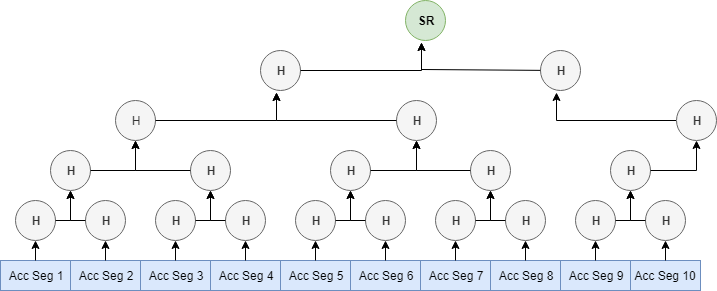
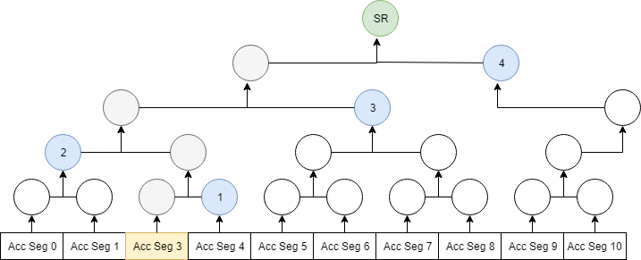
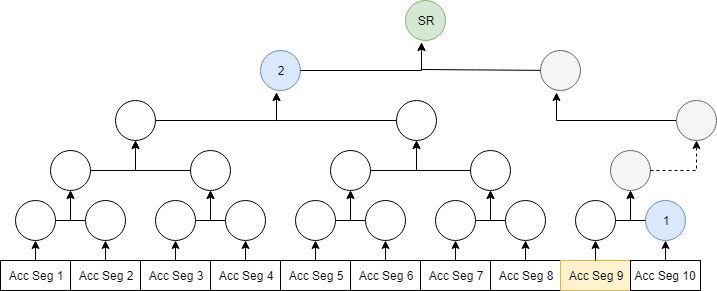

<pre>
  PIP: PIP-0030
  Title: SafeBoxRoot: Deletable SafeBox and Light-Nodes
  Type: Protocol
  Impact: Hard-Fork
  Author: Herman Schoenfeld <herman@sphere10.com>  
  Copyright: Herman Schoenfeld, 2019 (All Rights Reserved)
  License: GNU Public License 
  Comments-URI: https://discord.gg/sJqcgtD  (channel #pip-0030)
  Status: Proposed
  Created: 2019-04-07
</pre>

## Summary

A new "SafeBoxHash" algorithm is proposed that enables secure deletion of the SafeBox for non-mining nodes such as "light-nodes".

## Motivation

In PascalCoin, a full-node only requires a relatively small SafeBox and 100 blocks of the blockchain in order to participate in the protocol.  Whilst this is an order of magnitude improvement to traditional cryptocurrencies, it is still excessive load for a smooth UX on a mobile device. Also, for IoT devices that are processing embedded chains, requiring a SafeBox and 100 blocks to validate their chain is burdensome.


To improve this, first consider that how PascalCoin works. Users own accounts (PASA) to send/receive operations between those accounts. These accounts are contained within Account Segments, which are contained within the SafeBox. Blocks append a new and mutate existing Account Segments. The SafeBox is always finished with a hash of itself, which new blocks must reference if they intend to append. 


It is proposed by this PIP to change the SafeBoxHash algorithm to be a **merkle-root of the Account Segments**.This is to be called the SafeBoxRoot and marked SR in below diagram.



By changing the SafeBoxHash to be the SafeBoxRoot, it becomes possible for light-clients to cryptographically prove the validity of an Account Segment **without** the SafeBox. The benefits of this capability include:

#### Instant Wallet Synchronization

Light-nodes will no longer require to syncronize and validate the SafeBox or the last 100 blocks. Instead, in order to validate their accounts they will simply query other nodes for the latest **SafeBoxRoot** and the Account Segments for the accounts they care about. The response will include short merkle-proofs that can be used to cryptographically prove those Account Segments are connected to the SafeBoxRoot.

In effect, this results in an near-instant synchronization for light-nodes.


#### Layer-2 Efficiency

Layer-2 nodes depending on [embedded chains][3] for consensus will be able to rapidly validate and sync their chains without being burdened with other irrelevant Layer-1 information. Conversely, Layer-1 network is not excessively burdened by a multitude of Layer-2 networks demanding large amounts of data just to validate a single account.

#### Decentralized Network Topology

Many cryptocurrencies claim to be "decentralized" but typically this only means that users "own their keys" or that mining is somewhat distributed.

However, due to the ever-increasing complexity of storing, validating and updating their blockchains, almost all users of almost all these other cryptocurrencies depend on centralized 3rd party servers to access and use those networks. 
For example, almost all crypto-wallets today depend on 3rd party servers to query for balances, to relay transactions and to receive payment notifications.

Furthermore, access to these centralized servers requires closed-source mobile apps that are distributed on centralized app stores managed by 3rd parties sympathetic to censorship. 
As a result, even a mild attempt at censorship by a government actor could effectively disrupt almost all cryptocurrency usage today. With this PIP, PascalCoin resolves this issue by allowing **all users** to participate in the peer-to-peer network directly whilst retaining the user-experience users have come to expect from these popular wallets.

Even in a global adoption scenario, millions of users will be able to access the PascalCoin network in a near-instant manner since they no longer need a SafeBox (or blockchain) to participate.

This is not possible on other cryptocurrencies.

#### Natural distributed load-balancing 

SafeBox (in combination with this PIP), solves another major issue afflicting decentralized consensus systems.

Since the merkle-proofs outlined in this PIP apply to **Account Segments** and not just individual accounts, there's always a small chance that a light-node possesses the Account Segment and proof that another light-node may be requesting. It follows that a sufficiently large **set of light-nodes** attains a **high probability** of possessing an Account Segment and proof any new node may be requesting.

This leads to an astonishing outcome, since by employing basic request relaying and response caching, the entire SafeBox distributes itself over the light-node sub-network, multiple times over and rapidly. This allows light-nodes to service almost all of their own load **without** burdening full-nodes. Also, light-nodes can ensure they never propagate or receive stale cached values by simply re-applying the proof on the value using the latest SafeBox hash.

In this manner, light-nodes provide a natural and secure load-balancing mechanism for the entire PascalCoin network. This is **not** the case for other cryptocurrencies where their SPV-wallets always depend on a full-node to service their requests. In a global adoption scenario, these networks would grind to a halt as large numbers of SPV nodes overwhelm (and essential DoS-attack) a small number of full-nodes struggling with an ever-expanding blockchain.

As a result, this feature makes PascalCoin "global adoption ready".


## Specification

### SafeBoxRoot


The SafeBox Hash becomes the SafeBoxRoot, which is calculated from the Account Segments using **CalculateSafeBoxRoot**, specified below:
 
```pascal
  TAccountSegment = record
     BlockHeader : TBlockHeader;
     Accounts : array of TAccounts[1..5];
  end;
  

  function CalculateSafeBoxRoot(Segments : TAccountSegments) : TBytes[32]
  var hashlist : TArray<TBytes>; 
  begin
     SegLength(hashlist, Length(Segments))
     for i := 0 to High(Segments) do
       hashlist[i] := SHA2_256(Segments[i]); 
     result := CalculateRoot(hashlist)
  end; 


   function CalculateRoot(HashList : TArray<TBytes[32]> ) : TBytes[32]
   var nextLevel : TArray<TBytes[32]> 
   begin
      if Length(HashList) = 1 then begin        
        result := hashlist[0];  // found root
        exit;
      end;

      SetLength (nextLevel,  Ceil( Length(HashList) / 2 ) );
      
      for i := 0 to High (nextLevel) do begin
         var left := i*2;
         var right := i*2 + 1;
         
         if (right > High(HashList))
           nextLevel[i] := HashList[left];  // can't hash single item, just move up directly
         else
           nextLevel[i] := SHA2_256( Array.Join( nextLevel[left], nextLevel[right] ) );
      end;

      result := SafeBoxRoot(nextLevel);
   end
```

### Account Segment Proof

To prove an AccountSegment was used in the SafeBoxRoot calculation, the user first needs to have the SafeBoxRoot. This is acquired separately from the proof, typically via a sync. The purpose of the proof is to prove that a given Account Segment structure was used to calculate the SafeBoxRoot.

```pascal
  function IsValidAccountSegment(Segment : TAccountSegment; SafeBoxRoot : TBytes[32]; Hashes : TArray<TByte>>);
  begin
    var aggregateHash = SHA2_256 ( Segment ); // first we hash the segment

    for i = 0 to High(Hashes) do
       aggregateHash = SHA2_256( Array.Join ( aggregateHash, Hashes[i]) )

    // if aggregate hash matches root, then Segment is cryptographically verified AccountSegment
    if aggregateHash = SafeBoxRoot then
       result := true;
    else
       result := false;     
  end;
```


#### Example: Proof 1

* Users account is '12-12' and thus it lives in Account Segment 3 of SafeBox.
* User's retrieves Account Segment 3 from network, unsecurely.
* User determines the SafeBox root SR is correct most-work SafeBox (this is a future PIP, but can be normal sync for now).
* User asks a random node for **"proof of Account Segment 3"**.
* Node responds with four 32 byte hashes, *Hash_1...Hash_4*
* User performs the below validation proof:  



```
SR = HASH( HASH ( HASH( HASH ( HASH(AccSeg3) ++ HASH_1) ++ HASH_2 ) ++ HASH_3 ) ++ HASH_4 ) 
```

#### Example: Proof 2

* Users account is '45-45' and thus it lives in Account Segment 9 of SafeBox.
* User's retrieves Account Segment 9 from network, unsecurely.
* User determines the SafeBox root SR is correct most-work SafeBox (this is a future PIP, but can be normal sync for now).
* User asks a random node for **"proof of Account Segment 9"**.
* Node responds with two 32 byte hashes, , *Hash_1...Hash_2*
* User performs the below validation proof:  




```
SR = HASH( HASH ( HASH(AccSeg9) ++ HASH_1 ) ++ HASH_2 ) 
```

**Note**: the dotted line implies this level of the hash proof was skipped, since it was not hashed. This is automatic in the proof.


## Rationale

Simple change to SafeBoxHash calculation which can be used for powerful features in subsequent versions. 

## Backwards Compatibility

This change is not backwards compatible and requires a hard-fork activation. 

 
## Links

1. [Clifton, M. (2017). Understanding Merkle Trees - Why use them, who uses them, and how to use them. Accessed 2019-02.][1]
2. [Schoenfeld, H. (2019). PIP-0029: Account Seals: Cryptographically Secure Account Histories. Accessed 2019-02.][2]

[1]: https://www.codeproject.com/Articles/1176140/Understanding-Merkle-Trees-Why-use-them-who-uses-t
[2]: https://github.com/PascalCoin/PascalCoin/blob/master/PIP/PIP-0029.md
[3]: https://github.com/PascalCoin/PascalCoin/blob/master/PIP/PIP-0029.md#pasa-as-an-embedded-chain