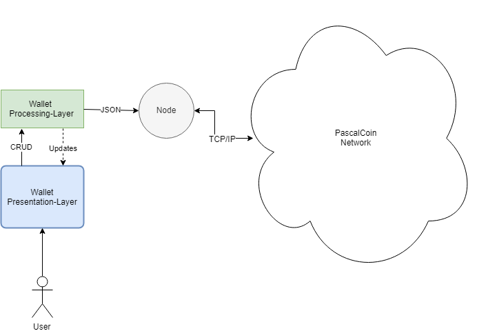
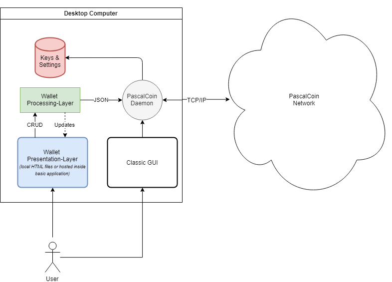
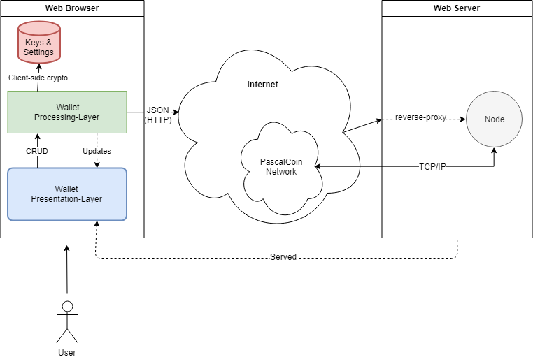

<pre>
  PIP: PIP-0031A
  Title: New Wallet: Multi-Platform & Multi-Paradigm
  Type: User Interface
  Impact: None
  Author(s): Herman Schoenfeld <herman@sphere10.com>, <Other Authors>
  Copyright: Herman Schoenfeld, <Other Authors> , 2019 (All Rights Reserved)
  License: GNU Public License 
  Comments-URI: https://discord.gg/sJqcgtD  (channel #pip-0031)
  Status: Withdrawn
  Created: 2019-04-15
</pre>

## Summary

It is proposed to build a wallet to serve all use-cases, all platforms, all configurations and all languages.

## Motivation

PascalCoin is a unique codebase cryptocurrency written from scratch by Albert Molina. 

Whilst the PascalCoin Wallet is fully featured, very stable and on par with Bitcoin Core's QT wallet, many users find it overly technical. 

As a result, a new wallet is being proposed by this PIP. This new wallet should be a single re-usable codebase that can be adapted to all possible deployment configurations. In short the wallet will support:
* **Desktop Mode**: the wallet can be launched from any desktop and connect to a local or remote node.
* **Mobile Mode**: the wallet can be deployed as an app and conect to a remote node, or an in-process node running in the app.
* **Web Wallet**: the wallet can be deployed as a client-heavy web-application that depeneds on a web-server node.
* **Layer-2 Support**: the wallet serves as a base-platform for layer-2 dapps to extend and add their functionality, either as plugins or custom forks.
* **Configurable Network Topology**: irrespective of deployment platform, the wallet should support remote-node (server) or in-process-node support (P2P).
* **Internationalized**: the wallet can easily be switched to different languages


## Specification

The goal of the new wallet is to achieve the following:

* Maximal platform coverage (Windows, Linux, macOS, iOS, Android, Windows Phone)
* Re-usable codebase: code is maximally re-used across all platforms 
* Layer-2 Support: layer-2 dapps can be shipped as plugins to the wallet or as custom re-distributions of the wallet
* Internationalization: provide interface for all languages

### Architecture

The wallet is comprised of the following sub-systems:
* **Presentation-Layer**: an HTML-based GUI used by the user. This layer relies only on the Processing-layer and nothing else. The processing layer is responsible for responding to and pushing updates to the HTML layer, including **page navigation**. 
* **Processing-Layer**: this is a well-defined set of Javascript APIs that are used by the Presentation-layer for all it's Create/Read/Update/Delete operations. Whilst the interface into this layer is constant, the implementation can vary between platforms.
* **Node**: this is a full node that the Processing-layer depends on. It can be either in-process, out-of-process or even remote. Typically, it will be the PascalCoin daemon.



The above architecture is **abstracted** since it is intended to be deployed in a variety of specialized, concrete architectures. These architectures include:

#### Delta Configuration

This deployment configuration is intended to be shipped with desktop installation of PascalCoin. It can compliment Classic GUI and provide macOS users with a GUI.



**Key Points**
* Web-server initially delivers the Presentation-layer to the users browser, which can be cached long-term.
* Can be executed by simply loading HTML files from local folder


#### Omega Configuration

This deployment configuration will be used to deliver the wallet as a web application to the user. This is typically known as a **web wallet**.



* Web-server initially delivers the Presentation-layer to the users browser, which can be cached long-term.
* Key and settings state is managed client-side using [HTML5 Web Storage][1]
* Operations are signed client-side using javascript.
* Keys and settings are stored using 


#### Omicron Configuration

This deployment configuration will be used for full-node mobile apps.


* Same as Omega, except HTML is hosted inside an app with an embedded browser (the app host).
* A platform-specific mobile component plugs into into processing layer and intercepts certain calls, for native UX.
* Screen transitions, pop-ups, alerts and cryptography is performed using native platform APIs for performance.

### Presentation-Layer 

* The presentation-layer is to be comprised of custom, hand-coded HTML pages. 
* It needs to be responsive and adaptive to mobile, tablet and desktop screens.
* There must be no link-based navigation (except for language changing) as all navigation must be routed through to processing-layer navigation object. 
* A suitable design should be negotiated with community and provided in this PIP.
* Javascript dependencies should be well thought-out and slim.
* Large library depedency with only minor usage will not be accepted.
* The wallet should load, display and perform fast.
* All text in wallet should be prefixed with ```<!--[TEXT]:unique_name--> TEXT <!--[/TEXT] -->``` so a grep-like tool can pre-process differnt language versions of all pages.
* There should be a banner at top which allows language selection and which displays correct page

### Processing-Layer

This is composed of various Javascript modules including:
* GUI Navigation
* Cryptographic functions
* Data Access Layer (DAL) for Presentation layer


## Rationale

The approach undertaken by this proposal offers maximal platform-coverage and extensibility, as the below table illustrates.

| Configuration                            | Delta Configuration | Omega Configuration | Omicron Configuration   |
| :--------------------------------------- | :-----------------: | :-----------------: | :---------------------: |
| Packagable as desktop app                | Yes                 | Yes                 | Yes                     |
| Packagable as mobile App                 | Yes, slow           | Yes                 | Yes                     |
| Distributable as a web App               | Yes, but key risk   | Yes                 | No                      |
| Can run needing server                   | Yes                 | Yes                 | No                      |
| Can run Peer-to-Peer                     | Yes                 | No                  | Yes                     |
| Extensible via Layer-2 dapps as plugins  | Yes                 | Yes                 | Yes                     |
| Re-packagable as standalone Layer-2 dapp | Yes                 | Yes                 | Yes                     |


## Backwards Compatibility

This change is not backwards compatible and requires a hard-fork activation. 

 
## Links

1. [HTML5 Web Storage. W3Schools.com. Accessed 2019-04.][1]

[1]: https://www.w3schools.com/html/html5_webstorage.asp
