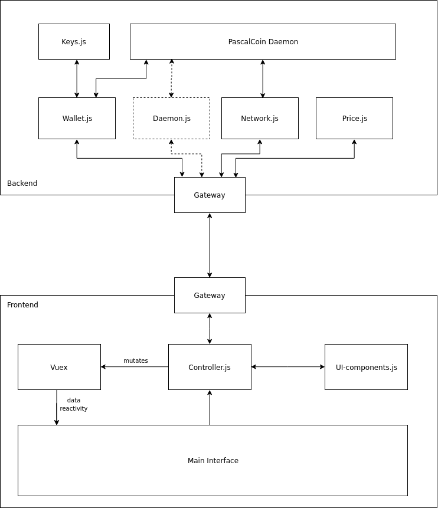

```
  PIP: PIP-0031B
  Title: New GUI Wallet
  Type: User Interface
  Impact: None
  Author(s): mosu_forge <mosu.forge@protonmail.com>
  Advisor(s): techworker <benjaminansbach@googlemail.com>
  Copyright: mosu_forge <mosu.forge@protonmail.com>, 2019 (All Rights Reserved)
  License: GNU Public License 
  Comments-URI: https://discord.gg/sJqcgtD  (channel #pip-0031b)
  Status: Draft
  Created: 2019-04-22
```

## Preface

Anyone who has been around PascalCoin knows it has great technology behind the scenes. For those familiar with the project, the current GUI wallet works fine, and is actually quite powerful. However for those not familiar with the tech behind PascalCoin, the current wallet can be confusing to use. For example, most users expect to see a `Send` button where they can easily send coins. They are not expecting to have to navigate to `Project > New Single Operation` to make a transfer, nor do they even know that a transaction is called an operation in PascalCoin.

This proposal is to create a single unifying GUI that is cross platform running on Windows, Linux, macOS, web, iOS, and Android. The user interface will be user-friendly, and familiar to users of other cryptocurrencies. This wallet will compliment the current full GUI, which will remain for advanced users. In short, this proposal would deliver a new desktop GUI, a web wallet, and mobile wallets.

## Deliverables
* Project written with modern Javascript standards, conventions, and toolchain. No complex dependencies, only node.js and package.json. All software used will be F/OSS, be able to run on all major operating systems, and not require any licensing fees.  
* Frontend built with Vue.js and Quasar framework. Interface will be completely translatable with smooth navigation and no page reloads.  
* Processing layer completely independent of any user interface code and built as a separate Javascript package. The processing layer can be used for headless applications or Layer 2 apps so programmers do not have to re-invent the process of storing keys, making rpc calls, fetching price info, etc. Will heavily use @techworker’s sbx library.  
* General purpose wallet built as a single page html file + assets that can be run locally in a browser or packaged in numerous ways.  
* Desktop app packaged with Electron.  
* Web wallet built as a Progressive Web Application (PWA) that can run in either a browser or installed directly to the user’s phone or desktop without them having to download or install any executables.  
* Mobile apps (iOS, Android) packaged with Cordova.  
* Clear instructions on how to build the wallet for all platforms.  

### Frontend

For this proposal, [Quasar framework][1] would be used. Quasar allows developers to easily build to desktop, mobile, and web apps with a single codebase. Quasar also provides user interface components, but relies on Vue.js, vuex, and node.js to provide the underlying functionality. Working with Quasar is easy for anyone who has ever worked with Vue.js. The wallet will be easily translatable into many languages and have a clean, modern  interface.

### Processing layer

The processing layer powers all wallet functionality, such as creating and storing encrypted keys, creating and signing transactions, API calls to local or remote daemons, as well as related functionality such as fetching live price info. It will be built to be totally re-usable and not bound to any user interface components. Thus, it can be re-purposed for numerous applications where a developer should not need to reinvent common functionality. Developers will be able to develop their own user interface for custom applications such as Layer 2 apps and not have to worry about low level details, such as a on-chain chat app.

### General purpose wallet

This deliverable will contain a single index.html file, along with compressed Javascript, CSS, and static assets. Estimated size is about 5MB. Users can download and run it locally. If local daemon is needed, user will have to manage separately. While possible for an end user to use this deliverable, they will likely want to use one of the packaged apps.

### Desktop wallet

The general purpose wallet downloaded as a simple HTML file has some drawbacks. First, it doesn’t provide its own application window and is bound to run in a browser tab. It cannot access the filesystem, nor can it manage a local daemon process. Since many people have different or not up to date browsers, there can be compatibility issues. Most importantly, a simple webpage runs on a single thread, and heavy cryptography functions can block the user-interface providing a bad experience to the user.

For desktop users, the wallet will be built as an [Electron app][2], which bundles a browser runtime together with the general purpose wallet to provide a much nicer user experience. Binaries will be provided to the end user in the way they are accustomed to. For Windows, both an installer and a standalone exe will be provided. For macOS, a dmg file will be provided. And for Linux users, an AppImage.

Electron provides native filesystem access so users will be able to store keys in the filesystem instead of in browser storage which will provide greater security. Other options such as minimize to tray and a native window decorations will be available. The desktop app will utilize two threads for the frontend and processing layer to ensure a smooth experience.

### Progressive Web App

A [progressive web app][3] can be used either as a web wallet, or as a native app. Users will be able to navigate to a url such as "pascalwebwallet.com" and instantly get started without syncing any chain or downloading any software. All keys would remain local, and never be sent to a server.

This deliverable is perhaps the greatest benefit of the approach outlined in this doc. Progressive web apps are super lightweight, but still provide a native app experience. The user would be able to install the wallet to their desktop or mobile device with out actually installing any software and there is no risk of user downloading viruses. Over the next few years, progressive web apps will become a new standard of application development. PWAs are cutting edge technology that very few cryptocurrencies have utilized so far, so PascalCoin has a chance to be bleeding edge.

### Mobile Apps

The same wallet built for desktop and web will be packaged with [Apache Cordova][4] as a native app. The wallet will be pushed to the app stores for Android and iOS. While most users expect a native app in the app stores, mobile users will also be able to use the Progressive Web App to install the wallet to their device. This method provides instant app updates and bypasses app stores, providing a lightweight alternative.

## User Interface Design Details

As outlined in the preface, the current GUI is sometimes confusing for new users. While building a new user interface, user-friendliness should be a top consideration.

### Wallet vs Keys vs Account

One of the most confusing aspects of any cryptocurrency, including PascalCoin, is the distinction between wallets and keys. With PascalCoin, there is also another layer, PascalCoin Accounts (PASA). For this wallet, it might be proposed that each wallet is comprised of only one private/public keypair, and each wallet can contain multiple accounts. The GUI will be able to support multiple wallets each secured by their own password, with quick switching between them.

### Operations vs Transactions

PascalCoin is again unique in that it supports many operation types. Transferring coins is of course the most used operation, so this functionality should be easy to find and use. However, the wallet should support other operation types as well. It is proposed that send operations have a dedicated "Send" page while other operations are under an "Operations" page.

### View-only Wallets

This new GUI can provide a view-only wallet functionality. Users would restore a wallet by importing the public key only and be able to audit an account, but not make transactions. This also allows users to keep their private key in cold storage, but still keep an eye on their accounts.

### Demo Interface

A mock layout will be packaged as a Progressive Web App to demonstrate a various components that could be used for the design of this wallet. This PIP will be updated when available.

## Technical Details



As mentioned in previous sections, the wallet will be built as two distinct components: Frontend and Backend. Each component will be completely separate and only communicate through a small gateway that relays messages and actions between the two components. Because of this, the frontend could be completely replaced with another interface, or discarded all-together for developers who want to make headless applications.

Below is a more detailed write-up of each sub-component.

### Frontend

**Main Interface**

Built with Vue.js and Quasar Framework, this is a responsive interface that works for all screen sizes and platforms using vue-router for page navigation. It will use vuex for data-reactivity making designing screens and templates very simple. It will be fully translatable to any language, including right-to-left languages.

**Controller.js**

Typical controller pattern. The main interface asks the controller to do all tasks such as creating a transaction, which will be sent to the backend. The controller does not need to communicate directly back to the main interface, instead it will mutate a vuex store which the main interface reacts instantly to.

**Vuex**

One of the most powerful aspects of Vue.js, vuex handles the central state of the frontend application. The controller mutates the vuex store which is then rendered by the main interface.

**UI-components.js**

This file will contain abstracted user interface components such as pop-up boxes, password prompts, alerts, etc. It may be overrided on a per platform basis if native UI components are needed. The controller should use these components for example when prompting the user for their password.

**Gateway**

This file is a small communication layer to send messages from the frontend to the backend. Abstracting this component is necessary because when building an Electron application, two threads are provided for the render and main process, and inter process communication is used. Having this component separate also allows a lot of flexibility of separating the frontend and backend components.

### Backend

**Gateway**

The sibling component to the gateway in the frontend. It is simply responsible for receiving messages from the frontend, routing them to one of the backend components, and sending back results.

**Wallet.js**

This component deals with the majority of business logic. It contains methods to sign operations, getting account transactions, etc. It communicates directly with the keys component.

**Keys.js**

This component is responsible for storing, encrypting, and decrypting keys. It is built separately from wallet.js to allow for different storage options. For example on desktop, keys would be encrypted and stored in the filesystem, while on web they would be stored with the browser’s localstorage. Vetted encryption libraries will be used such as tweetnacl, and key derivation pbdkf2.

By abstracting key storage, multiple applications may read from the same keys, but the user will be required to enter their password into each application to decode keys.

**Daemon.js**

This component would manage a local daemon including start, stop, add peers, and other functions. Because PascalCoin only has a standalone daemon for Linux, it would not be used for the majority of users. This component wouldn’t be implemented initially, but the design will leave open the possibility for it to be easily implemented in the future.

**Network.js**

This component would handle getting various non-wallet related stats from the PascalCoin network, such as chain height.

**Price.js**

This component is an example of other functionality the backend can provide. In this case, it would be responsible for fetching live price stats from the internet.

**PascalCoin Daemon**

The daemon can be either remote or local. The only information the other parts of the backend need to know is the IP address and port that it can make RPC request to. In most cases, it will be a remote service.

Keys would always be managed with Javascript, and never the PascalCoin daemon. This allows a user to switch from local to remote node seamlessly.

## Backwards Compatibility

This change is backwards compatible and does not require a hard-fork activation. 
 
## Links

1. [Quasar Framework v1][1]  
2. [Electron.js][2]
3. [Progressive Web Applications][3]  
4. [Apache Cordova][4]  

[1]: https://v1.quasar-framework.org/  
[2]: https://electronjs.org/  
[3]: https://developers.google.com/web/progressive-web-apps/  
[4]: https://cordova.apache.org/  