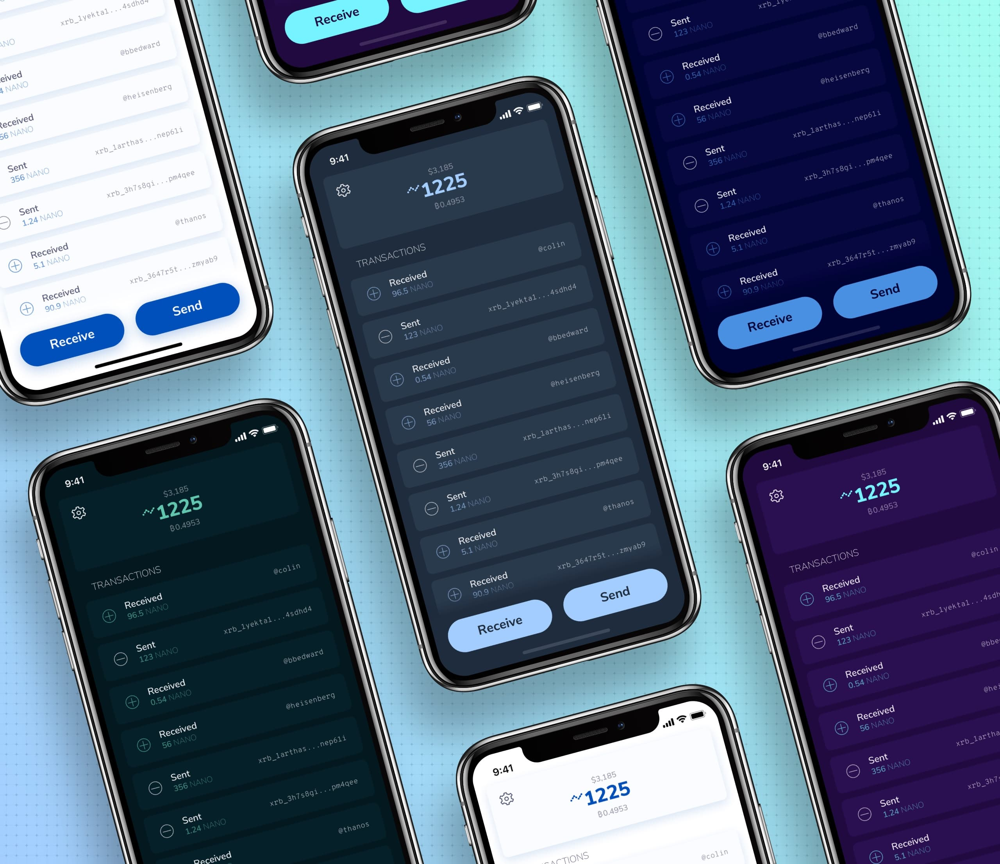
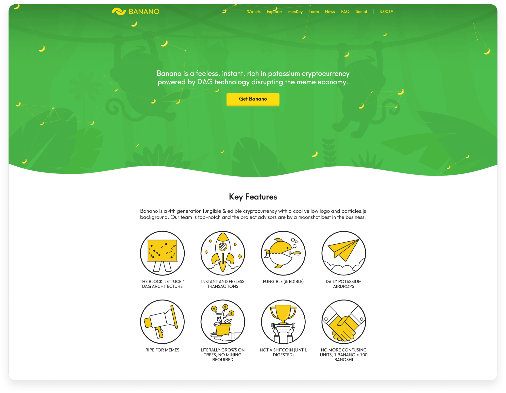
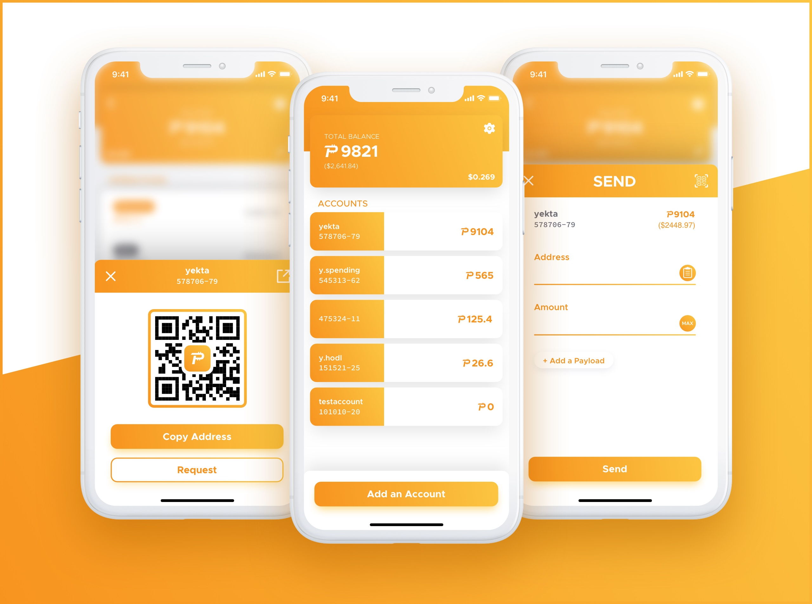
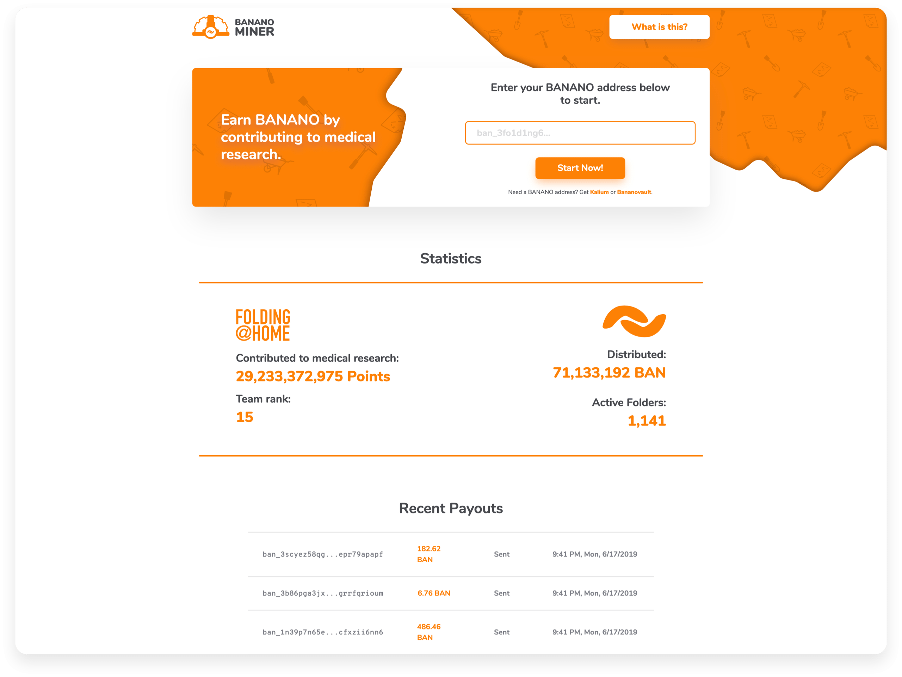

# PIP-0034A Website UI/UX Redesigns
## Full PIP: https://github.com/yekta/PascalCoin/blob/master/PIP/PIP-0034A.md

## Overview
The websites of a cryptocurrency often serves a gateway to bring potential new users by introducing them to the project. They also act as a news source and a wiki for existing users to learn more about the cryptocurrency. The content of these websites often seen by the new users as an initial way of judging the potential of given project. Because of these reasons, the websites need to be intriguing, understandable and beautiful while clearly communicating the core values and the products that the cryptocurrency offers.

We are proposing to redesign the user interface and the user experience of pascalcoin.org, explore.pascalcoin.org, and freepasa.org by applying these principles while adhering to existing code-structure/frameworks.

## Deliverables
1) The design of the website including all the source files, animations, illustrations, and the implementation guide.
2) Application of the suggestions and revision(s) (up to 3 rounds of revisions).

## Timeline
* Completion of deliverable #1: 12 days.
* Completion of deliverable #2: 2-6 days (varies depending on the number of revision requests).

## Payment Schedule
* $2000: Upon completion of (1).
* $500: Upon completion of (2).

Total: $2500

(It is extremely rare that more than 3 rounds of revision requests are required, but if that's the case, each round of revision after the 3rd one will cost additional $250)

## Licensing
The design, artwork, animations, and other assets that are created by us for this proposal will be released under [**CC0**][creative-commons] license, or any license suggested by PascalCoin Foundation.

## Background
We encourage you to check out some other websites and application that have been designed and developed by us. These are listed below:

| Link | Description |
| :----- | :------ |
[natrium.io](https://natrium.io) | NANO Wallet, developed with Flutter. Available on the iOS App Store and Google Play Store (Open Source)
[blaise wallet](https://appditto.com/blaisevideo) | Blaise Wallet, which we are currently developing for PascalCoin
[kalium.banano.cc](https://kalium.banano.cc) | BANANO Wallet, developed with Flutter. Available on the iOS App Store and Google Play Store (Open Source)
[monkeytalks.cc](https://monkeytalks.cc) | Monkey Talks - open source on-chain chat and faucet for BANANO developed with Vue and Python (Open Source)
[nanopaperwallet.com](https://nanopaperwallet.com) | Paper wallet generator for NANO (Open Source)
[bananominer.com](https://bananominer.com) | Folding@Home faucet for BANANO
[banano.cc](https://banano.cc) | BANANO's website
[appditto.com](https://appditto.com) | Appditto website
[loopelf.com](https://loopelf.com) | Loop animations for neat projects
[sinenur.art](https://sinenur.art) | A website for an aspiring industrial designer
[animations](https://www.2dimensions.com/a/yekta/files/recent/all) | Various flare animations created by us

### Natrium

### Banano Website

### Blaise Wallet

### Banano Miner

[creative-commons]: https://creativecommons.org/share-your-work/public-domain/cc0/
[sketch-app]: https://www.sketch.com
[figma-app]: https://www.figma.com
[ae-app]: https://www.adobe.com/products/aftereffects.html
[illustrator-app]: https://www.adobe.com/products/illustrator.html
[lottie]: https://airbnb.design/lottie/
