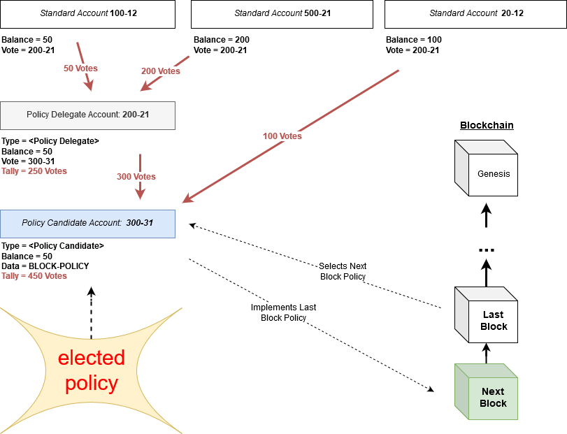
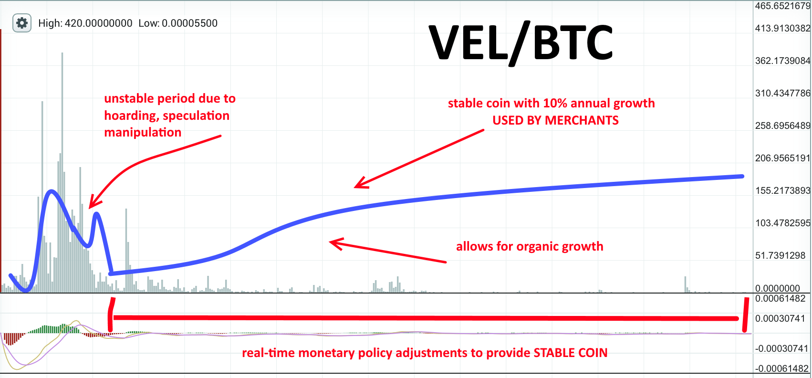
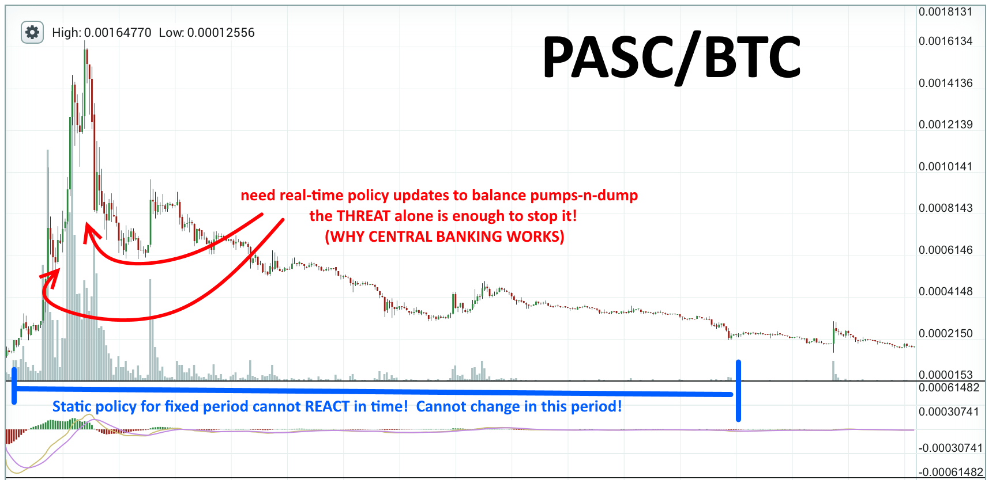

<pre>
  PIP: PIP-0035
  Title: Block Policy: A New Vision
  Type: User Interface
  Impact: None
  Author(s): Herman Schoenfeld <herman@sphere10.com>
  Copyright: Herman Schoenfeld, 2019 (All Rights Reserved)
  License: GNU Public License (with custom clause)
  Comments-URI: https://discord.gg/sJqcgtD  (channel #pip-0035)
  Status: Draft
  Created: 2019-06-18
</pre>

## Summary

A simple and efficient layer-1 governance model is proposed called "Block Policy". In the opinion of the author, the introduction of Block Policy is a game-changing innovation that fundamentally changes the underlying "economic code" of PascalCoin, and any other cryptocurrency which adopts it. Whilst only a minor technical change, it solves many problems afflicting cryptocurrencies today. 

## Re-brand & License

If adopted, this proposal will fundamentally change the original vision of PascalCoin. As a result, a re-brand is now warranted and fully justified. Also, since the author has [contributed significantly][1] to PascalCoin's architecture and code, the author imposes the following conditions on the adoption of this proposal:
* Block Policy is adopted fully or not at all;
* PascalCoin is re-branded;
* The author shall be legally considered a "co-founder".

No part of this proposal may be disregarded in the implementation without the consent of the author. Apart from this condition, GNU Public License applies.

A proposed new brand for the project is "Velocity Cash" and domain names and web-assets have been secured for this re-branding. However, the author is flexible on alternative re-brands and will work closely with the PascalCoin community to reach a re-brand consensus assuming approval of this pip.

In the interim, PascalCoin will herein be referred to as "Velocity Cash" for the remainder of this document even though it may be subject to a different re-brand.

## Layer-1 Governance

The proposed technical update fits so naturally into the SafeBox model, that in the opinion of the author, it's as if it SafeBox was "made for this". For this reason (and out of respect for the community) it is being proposed as an upgrade to the original project rather than implemented as a spin-off project (which it very easily could be). 

In short, the proposal is to:
* Re-implement existing technical and economic protocol constants as dynamic variables.
* Allow accounts to vote on what these variables should be using a SafeBox signaling mechanism. 
* Allow these variables to change on a block-by-block basis, enabling real-time governance.
* No longer award new accounts to miners, instead issue them without ownership and list them for public sale at a floating price. 

#### Diagram



### Block Policy

Instead of hard-coded constants defined in the source code, the following protocol constants will become policy variables for the next block:

| Variable                      | Length (b)   | Description                                                  | 
| :---------------------------- | :----------- | :----------------------------------------------------------  |
| Miner Reward                  | 1            | Miner reward for the next block                              |
| Developer Reward              | 1            | Developer reward for the next block                          |
| Developer Reward Account      | 4            | Account that accepts developer reward                        |
| Infrastructure Reward         | 1            | Infrastructure reward for the next block                     |
| Infrastructure Reward Account | 4            | Account that accepts infrastructure reward                   |
| New Account Price             | 2            | Floating price of unowned newly mined accounts               |
| Accounts Per Block            | 1            | Number of accounts created by next block. Still fixed at 5, dynamic in V6.|
| Vote Methodology              | 1            | Method to tally votes in next block                          |
| Difficulty Offset             | 4            | Difficulty offset to smoothen hash-rate volatility            | 
| RESERVED                      | 13           | Reserved for future use                                      |

These variables will be grouped together into a 32 byte structure known as the **BLOCK POLICY**. The Block Policy encapsulates important technical and economic variables which govern the consensus rules for the next block. It also governs the structure of the new account segment created in the SafeBox, as demonstrated below.

**Current PascalCoin Account Segment Structure**
```
[Block Header]
[Account No: X+0, Key: Block.MinerKey, Balance: ROUND(BLOCKREWARD * 0.8, 4-decimal-places)]
[Account No: X+1, Key: Block.MinerKey, Balance: 0]
[Account No: X+2, Key: Block.MinerKey, Balance: 0]
[Account No: X+3, Key: Block.MinerKey, Balance: 0]
[Account No: X+4, Key: SafeBox.Account[0].Key, Balance: ROUND(BLOCKREWARD * 0.2, 4-decimal-places)]
``` 

**Proposed Velocity Cash Account Segment Structure**
```
[Block Header]
[Account No: X+0, Key: Block.MinerKey, Balance: LastBlockPolicy.MinerReward]
[Account No: X+1, Key: Null, Balance: 0, State: ForPublicFloatingSale, Price = -1]  ;/ note: on purchase, Price is lookup of LastBlockPolicy.NewAccountPrice
[Account No: X+2, Key: Null, Balance: 0, State: ForPublicFloatingSale, Price = -1]
.
.
.
[Account No: X+(N-2), Key: SafeBox.Account[LastBlockPolicy.InfrastructureAccount].Key, Balance: LastBlockPolicy.InfrastructureReward]
[Account No: X+(N-1), Key: SafeBox.Account[LastBlockPolicy.DeveloperAccount].Key, Balance: LastBlockPolicy.MinerReward]

where
   let LastBlockPolicy = Block Policy as determined after last block
   let N = LastBlockPolicy.Accounts_Per_Block 
``` 

If the next block does not conform to the Block Policy of the last block, then it is considered out-of-consensus and orphaned by the network. If it conforms and inherits the greatest proof-of-work, then an account segment as per above is appended to the SafeBox.

### Voting

Since Velocity Cash is intended to be a decentralized cryptocurrency, who gets to define the Block Policy? Every user has different opinions on what the policy should be. An extremely efficient method for selecting Block Policy is proposed as follows:

* Users can propose a Block Policy by setting the following properties on their account:
```pascal
  account.Type = <Policy Candidate>
  account.Data = [Protocol Policy]
```

* Alternatively, instead of defining a block policy an account can simply act as a Policy Delegate to another accounts policy. To act as a Policy Delegate, the user sets the following properties on their account:
```pascal
  account.Type = <Policy Delegate>
  account.Vote = (Policy Candidate Account)    ;/ Vote is a new 4 byte field added to an account
```

* To vote for a Block Policy, users simply point their vote to the Policy Candidate (or Policy Delegate) account they prefer. They can do this by changing the following properties on their account:
```pascal
   account.Vote = <Preferred Policy Candidate/Delegate account>  
```


**NOTE** In an analogy to representative democracy, a Policy Candidate account is like a "political party" whereas a Policy Delegate is like a "political representative". Users can vote for the "party" directly or delegate their vote to a "representative" who votes on their behalf.

### Vote Tallying

After every block is mined, the Block Policy is determined by simply tallying the votes in a single sweep of the SafeBox as follows:

```pascal
  // set each accounts tally to 0
  foreach account in SafeBox.Accounts do
     account.Tally := 0

  // tally each accounts vote
  foreach account in SafeBox.Accounts do
     let preference = SafeBox.Account[account.Vote]
     preference.Tally += account.Balance

  // tally aggregated votes from delegates
  foreach delegate in SafeBox.Accounts do
    if delegate.Type = <Policy Delegate>
      let candidate = SafeBox.Account[delegate.Vote]
      candidate.Tally += delegate.Tally

  // pick winning candidate
  winner = -1;
  winnerVotes = 0;
  foreach candidate in SafeBox.Accounts do
    if candidate.Type = <Policy Candidate>
      if candidate.Tally > winnerVotes then
        winner = candidate.accountNumber
        winnerVotes = candidate.Tally
    
  // fetch policy from winning candidate data field
  let winning_policy = SafeBox.Accounts[winner].Data
```

**NOTE**: whilst the above pseudo-code uses 4 sweeps to demonstrate the algorithm easily, the actual implementation will use a single lightning fast sweep.

Once the winning policy is determined, the next mined block **must conform to the policy**. If the block does not implement the policy, including the correct miner/developer/infrastructure reward, then it is considered invalid and orphaned by the network.

### Vote Methodology

When tallying votes, the above snippet simply assumed that 1 COIN = 1 VOTE. In practice, there would be many methodologies available to tally the votes, each with custom rules. The specific methodology applied to a block is determined by the previous Block Policy, and thus can change from block to block. This approach maximizes the flexibility of the governance-model and allows users to transition protocol governance from autocratic to aristocratic to democratic models and the spectrum in between.

In the initial implementation, only two vote tallying methodologies are proposed:

| Name          |  Value | Description                                                    |
| :------------ | :----  | :------------------------------------------------------------- |
| Autocratic    | 0      | Account 0-10 has all the votes to determine next block policy. |
| Aristocratic  | 1      | 1 COIN = 1 VOTE. Same as "proof-of-stake".                     |

Post-implementation, the following methodologies are to be researched and developed:


| Name          |  Value | Description                                                    |
| :------------ | :----  | :------------------------------------------------------------- |
| Nobility      | 2      | X COIN = f(X) VOTES where f(x) = k*ln(X)^c for constants k,c   |
| Democratic    | 3      | 1 USER = 1 VOTE                                                |

Vote tallying methodologies are crucial for security, so as to prevent malicious actors from seizing control of the protocol.

## Governance Security

A major concern with the implementation of Block Policy is preventing the hijacking, attack and seizure of the policy by malcious actors or economically disproportionate actors ("whales").

This can be achieved by employing implementing this feature in the following manner:

1. **Autocratic Model**: In the initial implementation, the account 0-10 (controlled by Albert Molina) defined the block policy. This will remain in effect until a suitable time that dust settles from this change. During this period, the community can socially organize on Discord/Social Media to determine minor policy adjustments and Albert implements them.  Minor development/infrastructure adjustments can be made to fund specific projects during this period.

2. **Aristocratic Model**: After some time, this model is enabled allowing account holders to vote on policy on a 1 PASC = 1 VOTE basis. Conceptually this will work because it's the same a Delegated Proof-of-Stake used in EOS and other billion dollar coins. 

3. During (2), we allow a 2-year period where the Aristocratic model can be changed back to Autocratic using account 0-10. This is to ensure the protocol can be recovered in case the Block Policy is attacked, hijacked or mismanaged.

After a suitable period with significant R&D, the final and permanent governance model is rolled out.

4. **Democratic Model**: this works on 1 USER = 1 VOTE governance system for determining Block Policy. The author has significant R&d here to achieve this. Users could always vote to rollback to Aristocratic in case something goes wrong.

**NOTE** in between (3) and (4) there are also **Nobility Model** which can be rolled out. The Nobility Model encompasses a set of methodologies that represent a logical interpolation between Aristocratic to Democratic systems.

## Policy Limits

In order to prevent catastrophic failure such as issuing a billion new coins in a block, the byte lengths of policy variables are chosen so as to impose **natural limits** on the policy values.

For example, the miner reward is a 1 byte variable which constrains from 0 to 255 PASC. At any time, a maximum of 255 PASC can be issued as the miner reward. Even if the policy were temporarily hi-jacked by a mining pool, it would not be possible to cause any significant harm to eco-system in the time intervention was applied.

If byte lengths are insufficient to impose limits, hard-coded rule-based limits can be imposed on variables.

## Benefits

The benefits of this change are profound in nature and includes the following benefits:

### Real-Time Governance

This proposal introduces in-protocol real-time governance in layer-1 and establishes a cryptographically secure voting mechanism that can be audited by anyone, anytime, permission-free and instantly. By moving economic constants from the source-code and into the Block Policy, the layer-1 protocol is now fundamentally enhanced with "external-world feedback". This has far-reaching consequences at every level of the project including security, usability, adoption, governance and market-price.

Also, this proposal puts control of the protocol squarely in the hands of the users who can hire and fire developers and infrastructure providers via voting. It puts the economic power in the hands of the users since they can influence the price of the cryptocurrency via real-time adjustments to inflation. In the future, this role may optionally - depending on the community's approval - be delegated to AI-trained bots who regulate the protocol for the benefit of the community using neural networks trained on past behaviour.

### Crypto-Political Parties

Since an account can delegate their votes to other accounts who vote on their behalf, the notion of a "representative governance" is established. For example, there may be a "whale" with a lot of voting power but lacking sufficient personal time to participate in researching the best protocol policy. Conversely, there may be an expert enthusiast who "is poor" but participates regularly in the project with little voting power. The "whale" can now delegate their vote to the expert enthusiast who then attains greater influence in the project due to delegated voting power. The enthusiast can be compensated for this service by the community of "whale stakeholders" who entrust him/her rely to ensure protocol is governed at maximal efficiency.

### Separation-of-Powers

Following from [PIP-0011][2] which established a Developer Reward to fund development, the proposal here introduces a new reward called the Infrastructure Reward. This new reward is intended for a new organization separate to the developers and miners. This new organization will independently address the issue of infrastructure support and roll-out of the project. In essence, everything other than mining and development. 

By funding miners, developers and infrastructure directly from the protocol, a decentralized triumvirate governance architecture is established. This fundamentally solves the "conflict of incentives" issue which can lead to perverse outcomes in cryptocurrencies (as Bitcoin has shown). Since miners, developers, wallet providers and exchanges are funded independently from each other, it means:
* Community decides who the developers, wallet providers and exchange listings are, not a "core clique" or "benevolent dictator".
* Funding allocation model for Development and Infrastructure can vary, not a "one size fits all".
* Miners, developers and infrastructure will act primarily in the community interest rather than for special interests who control the levers of funding/power.
* Monopolistic, cartel and anti-competitive practices are thwarted since the ability to "capture power" via funding is by-passed. 
* Individual actors have greater independence and freedom of expression in the delivery of their outcomes, since not beholden funding cuts, threats or pressure from co-actors and hierarchies.
* Protocol governance is established yet remains fundamentally decentralized due to the triumvirate structure.

### Dynamic-Inflation 

By enabling on the community to vote on what the miner, developer and infrastructure rewards should be for the next block, the issuance-model of Velocity Cash is fundamentally changed from a "gold-like" model to a "fiat-like" model. Whilst many in cryptocurrency may consider this sacrilege, the reader is encouraged to understand the difference between "negative fiat" and "positive fiat" currencies. In the modern era, national central banks (with the exception of Iran) issue fiat currency as a debt-based instrument into the economy. In this model, the newly issued fiat currency represents a debt which must be repaid later by future issuance of this debt-based fiat (but compounded with interest). Such debt-based currency represents a "negative value" which almost always results in a pyramid-scheme style collapse causing the familiar negative economic outcomes of bankruptcy, recession, capital hoarding and centralization. In the "positive fiat-currency" model, the currency is issued as credit-based instrument that attains a "positive value" determined purely by the market supply/demand (just as cryptocurrencies are today). This "positive fiat-currency" model has historically successful precedents such as the [Colonial Scrip][3] which effectively built the American Colonies and the [Tally-Stick][4] system which effectively built the British Empire (before it collapsed soon after the introduction of the debt-based "British Pound").

The point here is that the negative outcomes commonly associated with "fiat currencies" are more to do with the "debt-based" aspect than the "fiat" aspect. This is an important and nuanced point.

### Enhanced Inflation-Distribution

One of the biggest flaws in cryptocurrency architecture today is the inflation distribution. Most cryptocurrencies simply distribute the new inflation to the miners who then act as first source of value utilization (usually for dumping on markets). This gives miners a disproportionately biased economic role within the eco-system. Miners only secure the network, they do not write the code, design the protocol, develop wallets or run exchanges. Yet they receive all the new inflation. By distributing the new inflation between miners, developers and infrastructure a more balanced distribution is achieved resulting in more efficient utilization of the newly created value.

### Long-Term Stable Value

Much in the same way that central banks have proven they can stabilize the value of national currencies through monetary policy, it is expected that the community can similarly stabilize the cryptocurrency value using the tools of real-time dynamic inflation adjustments. It should be stressed that Velocity Cash is not a stablecoin in the traditional sense. It is not strictly pegged to any price. Rather, it follows a piecewise price trajectory depending on the social contract. 

For example, if the Block Policy agrees that the monetary policy should attain $100 then the inflation would be at a bare minimum in order to support the miners, developers, and infrastructure providers. If the price at last attains $100, then inflation would increase in order to signal both an economic and a psychological deterrent for further price growth. However, if there is significantly more demand for Velocity Cash then the "soft" peg to $100 could then be allowed to adjust upwards subject to the Block Policy. An infinite ROI due to a forever increasing price is inherently unsustainable and harmful to the cryptocurrency; as a result, the Block Policy offers the opportunity and tool to serve as a soft stabilizer for Velocity Cash's price especially at a high market capitalization.

To promote a stable value in the other direction, the Block Policy also involves deflation adjustments through controlled burning of already circulating coin supply. The following sources of burning can be achieved:

1. **Coinrot**: coins on abandoned accounts due to user death/lost keys are considered rotten coins. Instead of awarding expired PASAs and their PASC to miners, the OP_RECOVER can be changed to simply burn these coins 

2. **Transaction Fees**: since miners are guaranteed miner reward, the transaction fee is no longer needed to incentivize mining. Instead, these fees are burnt and serve as a drain to extinguish coin supply.

3. Other multiple sources, not disclosed in this pip but will be revealed if/when after PIP approval.



#### Deterrent to Pump-n-Dump Problem

Much in the same way that the threat of force by law-enforcement prevents crimes from occurring, the threat of real-time inflation-intervention via community governance thwarts market manipulation. As a result, "whale" activity, hoarding and pump-n-dumping problems are expected to be greatly diminished.



### Reserve-Currency for a DEX

If Velocity Cash can achieves "soft stablecoin" status, it can serve as an ideal base currency in a decentralized-exchange (DEX), much in the same way that USDT serves this purpose today. The fundamental difference is that it is **not** "stablecoin" in the sense of having a fixed-value based on external backing, instead it's value is sensibly stablized via social consensus of the eco-system of users of the currency. The author of this PIP has designed a high-frequency DEX, and with the recently added [atomic swap functionality][1], Velocity Cash is perfectly positioned for this role.

### Currency for Commerce

Following from the above, an intrinsically stable cryptocurrency will also serve as ideal currency for commerce.

### Solves Long-Term Miner Incentive Problem

It is a known problem in existing cryptocurrencies that after the block reward extinguishes over repeated halving epochs, that miners will no longer have a sustainable income to continue their Proof-of-Work. Over time, this will result in a miner exodus that will grind the blockchain to a halt and compromise its security.

This proposal solves this issue since the community now provides miners a guaranteed income in perpetuity, due to dynamic inflation.

### Solution to Limited Account Problem

An on-going issue for the SafeBox-model has been the inability to on-board millions of new users during sudden adoption waves, due to the fixed issuance of 5 accounts per block. By moving this number to the Block Policy, more accounts can be created at any time to accomodate sudden adoption wave. Also, all newly created accounts will no longer be awarded to the miner. Instead they will be unowned and listed for Public Sale. The price for these accounts will **not** be fixed but instead be floating price determined by the Block Policy.

This proposal now guarantees that new accounts **will always be available** to new users **at a low price**. It's a community guarantee delivered via the Block Policy.

### True Infinite Scaling

In the same way PASA issuance can be increased to support new adoption, it can also be decreased to prevent SafeBox growth. So, after billions of accounts are created, the Block Policy can stop the production of new accounts effectively freezing the size of the SafeBox. In such a scenario, every new account segment would only contain the block-header (approx 100 bytes) without new accounts. This means the SafeBox could support maximum throughput with virtually 0 storage growth - Infinite Scaling.

### Solves PASA hoarding problem

Since new PASA will no longer be issued to miners, they need to be purchased from day 1. Also, since PASA issuance is dynamic and controlled by the community, their prices will always be low. This disincentives PASA hoarding completely.

## Upcoming PIP Disclosures

The following will be disclosed in full pending pip approval:

1. Security against gaming the Block Policy via an Aristocratic voting methodology.
2. Technical implementation of the Democratic voting methodology.
3. Sources of deflation control.
4. Others.

## Rationale

Since Block Policy is a simple change that fits naturally into the SafeBox model, it is proposed for upcoming V5 release.

## Backwards Compatibility

This change is not backwards compatible and requires a hard-fork activation. 

## Acknowledgements

* Tyler Swob for follow-up edits, in-depth discussion and helpful suggestions for altering the tone of this proposal.

## Links

1. [PascalCoin Improvement Proposals][1]
2. [Schoenfeld, H. PIP-0011 - 20% Developer Reward][2]
3. [Money Masters. Documentary.][3]
4. [Dodkins, M (2012). Tally sticks and the formation of the Bank of England. Accessed 2019-06-19.][4]


[1]: https://github.com/PascalCoin/PascalCoin/tree/master/PIP
[2]: https://github.com/PascalCoin/PascalCoin/blob/master/PIP/PIP-0011.md
[3]: https://www.youtube.com/watch?v=lbarjpJhSLw
[4]: http://seventeenthcentury.info/index.php?title=Tally_sticks_and_the_formation_of_the_Bank_of_England

