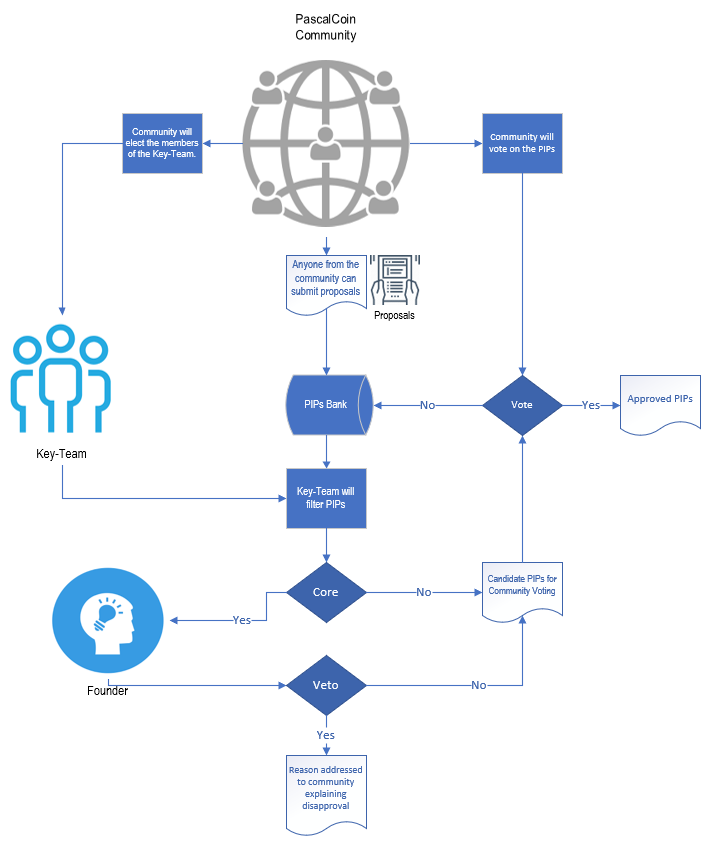
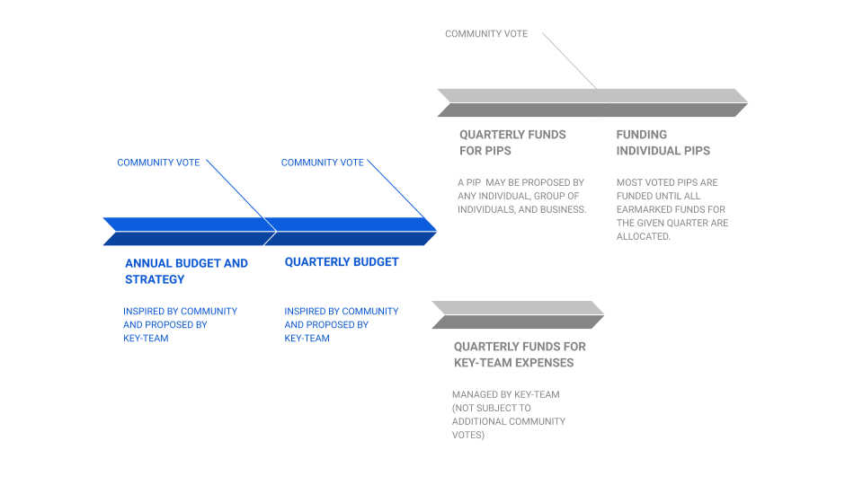
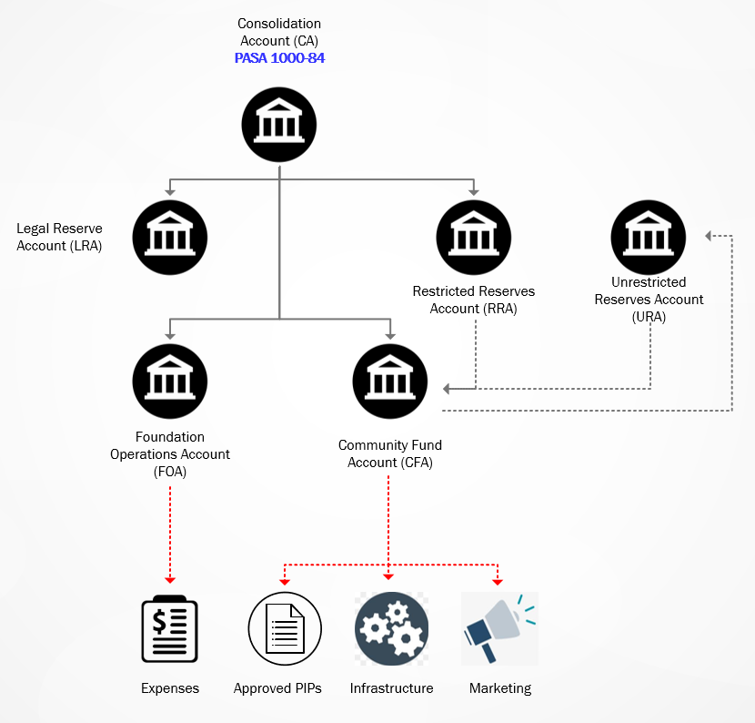
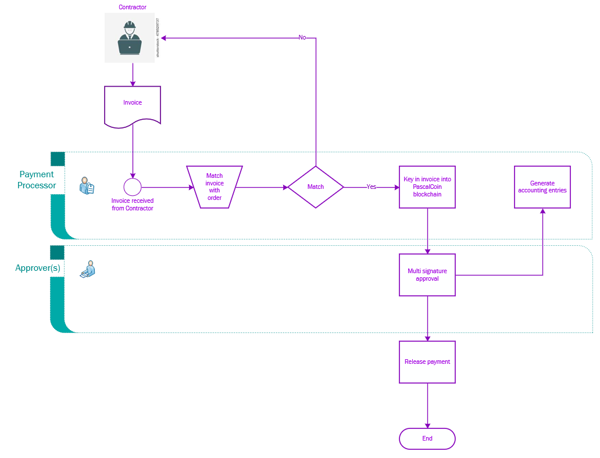

<pre>
  PIP: PIP-0040
  Title: Pascal Governance
  Type: Process
  Impact: None
  Author: Gynther and the Interrim Dao-Team (redmonski, earleone, cryptobjarne, joud, mosu_forge) with advise from nightraven, urbancohort, and Benjamin Ansbach
  Comments-URI: https://discord.gg/sJqcgtD
  Status: Draft
  Created: 2019-12-02
</pre>

## Summary

This PIP proposes a strengthening of the present governance structure of Pascal with the aim of bolstering the general workflow of the Pascal ecosystem and community. 

The proposed model will introduce an elected Key-Team that will be responsible for counseling, facilitating, and administering community decisions, including decisions related to the management of the Pascal Foundation. The power of the Key-Team will be strongly limited by direct community votes and a Founder’s Veto on changes to Pascal’s core tech. 

The proposed governance model is planned to be replaced by a DAO model in the future, if so decided by the community and if technically and practically feasible. 

The model is compatible with foundation requirements and other governance related PIPs. 

## Motivation

Pascal is a community project. The basic principle of its governance structure is based on decentralized community democracy. While this principle is indispensable to the project, it has never been formalized into an actual governance structure. Over the years and especially after the implementation of the Developer’s Reward (PIP 11), this has had some negative repercussions. Most decisions and votes have been taken more or less on ad hoc basis without clear guidelines for the actual voting process and for the subsequent administration of these decisions. Furthermore, the project has lacked the resources in time or man-power to work out and follow a budget and overall strategy in collaboration with the community. 

This PIP proposes a governance model for Pascal. The aim is to provide Pascal with the necessary structure in order for it to develop into a well-functioning and not least reliable organization on a long term basis. 

While it is a broad wish in the community to turn Pascal into a DAO, it is still unclear how such an organization should be built. For this reason, this PIP proposes a more traditional governance structure, which nevertheless is adjusted significantly towards decentralized community democracy. 

In addition, it should be noted that this PIP proposes that the Developer’s Reward and all other Pascal assets will be put under the custodianship of the Key-Team. The Pascal Foundation and account(-s) will have the restricted function of executing Key-Team and eventually community decisions as well as providing the legal framework of Pascal as an organization and business.  

<u>The PIP accordingly has two aims:</u> 

1. to immediately implement a strong and reliable governance structure that is inspired by more traditional organizations - albeit with a marked element of decentralization. 
2. to secure that an eventual DAO replacing the foundation will be equally stable and reliable as the proposed organization. This will be done by making it a stated objective of Pascal to research and develop a DAO. 

## Specification 

The following four diagrams describe the main elements of the proposed governance structure. The structure is further detailed in the proposed Bylaws (Appendix 1). 

### Diagram 1: Workflow

### Diagram 2: Budget Timeline

### Diagram 3: Accounts

Note: If for the fiscal year, CFA has a surplus or unspent budget - it will go to URA. Purpose of URA is for shortfall, contingencies, etc. No community voting is required for the URA usage.

### Diagram 4: Invoicing: 

## Appendix I: Pascal Bylaws

### DEFINITIONS: 

1. <u>Pascal:</u> The project’s software, community and ecosystem in general. 
2. <u>Pascal Community:</u> All people engaged in Pascal ecosystem at large.
3. <u>Community Member:</u> Any person in Pascal Community. 
4. <u>Founder:</u> Albert Molina
5. <u>Keyteam:</u> The managing body of Pascal 
6. <u>Community Vote:</u> The highest authority of Pascal. Any Community Vote is to be conducted in shape of a PIP.
7. <u>Community Voters:</u> Voting holders of PASC
8. <u>Developer’s Reward:</u> the funds allocated to the development of Pascal as of PIP 11.
9. <u>Pascal Foundation Limited:</u> The legal custodian of the Developer’s Reward and the assets assigned to it by the Pascal Community. 
10. <u>Pascal Improvement Proposal (PIP):</u> Proposals voted on by Community Voters that can be made by anyone with an idea for improving or developing any aspect of the Pascal blockchain and ecosystem. Can be funded or non-funded by the Pascal Foundation.
11. <u>Request for Comments (RFC):</u> A PIP draft made public for discussion by the author or the Key-Team with the purpose of developing it into an actual PIP. 
12. <u>Articles of Association:</u> Legal statutes as required by law under the jurisdiction where the Foundation is registered.
13. <u>Bylaws:</u> the rules and requirements defining the organization and workings of Pascal governance, i.e. this document.

### ARTICLE I: CORPORATE AFFAIRS

1. **PURPOSE, OBJECTIVE, AND SCOPE**
  - **1.1. The purpose**
    - **1.1.1.** Pascal is a group of persons or entities cooperating in order to achieve goals for the benefit of the Pascal Community.
    - **1.1.2.** Pascal is a community project. This requires Pascal to work in a fair, impartial, transparent, and democratic manner.

  - **1.2. Objective**
    - **1.2.1.** Pascal shall strive to be a state-of-the-art high quality blockchain software project.
    - **1.2.2.** Pascal shall strive to grow as a community, business, and ecosystem for the benefit of its multiplicity of stakeholders and community members. 
    - **1.2.3.** Pascal is to work towards becoming a Decentralised Autonomous Organization (DAO). The ultimate objective of this process is to fully replace the here proposed governance structure with a DAO under the condition that such an organization does not negatively interfere with the here stated purpose, objective and scope of Pascal.    
  - **1.3. Scope:** 
    - **1.3.1** All decisions related to Pascal is subject to the authority of a Community Vote. 
      - **1.3.1.1** Exception: Albert Molina may opt for a Founder’s Veto on any projected changes to core technology. 
    - **1.3.2** When making business deals or raising money, Pascal may never compromise its autonomy or its status as a democratically controlled foundation 

2. **LANGUAGE:** The official language of Pascal is English. 

### ARTICLE II: VOTING RIGHTS

1. Voting rights are to be described in a separate PIP. 
  - a) Most current version is: “Temporary Voting Procedure” PIP

### ARTICLE III: KEY-TEAM

1. **PURPOSE AND FUNCTION**
  - **1.1.** The purpose of the Key-Team is to manage, facilitate and stimulate the realization of Pascal’s purpose, objective and scope. 
  - **1.2.** The Key-Team is not a traditional board of directors, because a substantial part of its decision power is allocated to direct community votes. The function of the Key-Team is, therefore, on the one hand to offer continuous counsel and expertise in relation to these community votes.  On the other hand, the Key-Team is also responsible for the daily operations of Pascal. That is to say, it is responsible for providing the infrastructure and organization for facilitating and executing the decisions of Pascal Community, especially regarding the allocation of Pascal’s funds.
  - **1.3.** On behalf of the community, the Key-Team is to be the custodian of all Pascal’s assets including, but not limited to, the Developer’s Reward, PASA accounts 1000-1001, web domains, any official social media accounts (e.g. Discord, Facebook, Telegram, Twitter, Steem, Bitcointalk,etc.), all Pascal related documents (e.g. contracts, legal documentation, Bylaws,  PIPs, minutes from all meetings, etc.).
    - **1.3.1.** Exception: Albert Molina is to be the sole custodian of the Pascal Github and PASA accounts 0-10. 
  - **1.4.** The Pascal Foundation and account(-s) will have the restricted function of executing Key-Team and eventually community decisions as well as providing the legal framework of Pascal as an organization and business.
  - **1.5.** The Key-Team is to stimulate an open, inclusive, and respectful culture in the Pascal Community at large.

2. **KEY-TEAM POWERS**
  - **2.1.** The Key-Team is to manage the funds, business, and affairs of the Pascal project according to the Articles, these Bylaws, individual PIPs, and applicable law.
  - **2.2.** The Key-Team may decide to veto (with a 75% qualified majority) any PIP (not Founder’s Veto).
    - **2.2.1.** A Key-Team veto may be annulled by a subsequent Community Vote (appeal) backed by a likewise 75 % qualified majority. In this case, the Key-Team shall resign or stand for re-election. 
  - **2.3.** The Key-Team may adopt such rules and procedures, not inconsistent with the Articles, these Bylaws, individual PIPs, or applicable law, as it may deem proper for the conduct of its meetings and the management of Pascal.

3. **COLLECTIVE SECURITY**

  - **3.1.** Key-Team members are to protect the Pascal assets by multi-signature (off-chain or on-chain) approvals of spending and of any other transaction of said assets. 

4. **KEY-TEAM ROLES AND RESPONSIBILITIES**
   The Key-Team roles and responsibilities are and not limited to: 

    - **4.1.** In cooperation with Pascal Community at large to develop and propose the strategy and roadmap for Pascal blockchain and ecosystem. 
    - **4.2.** Responsible for facilitation, administration and oversight of PIPs. 
    - **4.3.** Responsible for daily operations of Pascal and other activities related to Pascal ecosystem assigned to it by Pascal Community.
    - **4.4.** To propose, oversee, and administer Pascal’s annual budget.
    - **4.5.** Propose trimestrial budget.
    - **4.6.** To represent and promote Pascal and the Pascal Community
    - **4.7.** To author PIPs both for Pascal spending and for the development of Pascal tech and its ecosystem in general.
    - **4.8.** Legally oversee Pascal. 
    - **4.9.** To engage community members in general and those contributing to the Pascal ecosystem in particular. 
    - **4.10.** To engage with community and follow up on its requests, proposals, and needs. 

5. **ELECTION AND SIZE**

  - **5.1.** The Key-Team shall consist of minimum 4 and maximum 8 members. 
  - **5.2.** Key-Team members may be added at anytime. Members are admitted through an open discussion within the Pascal Community and a final decision by a Community Vote. 

6. **KEY-TEAM MEMBER REQUIREMENTS**

  - **6.1.** Key-Team members must have an established history within the Pascal Community and must be able to provide expertise in areas helpful to the purpose of Pascal. Areas of expertise may include and not limited to:  finance, accounting, marketing, software development, legal, technical development expertise in any number of areas including and not limited to crypto currencies.
  - **6.2.** Key-Team members must be at least 18 years of age
  - **6.3.** Key-Team members must be proficient in English

7. **MEETINGS**

  - **7.1.** Meetings are to be held via electronic communication technology as specified by the Key-Team.
  - **7.2.** Minutes from all meetings are required and are to be filed with the records of Pascal.
  - **7.3.** Unless provided for differently elsewhere in these Bylaws, a majority of the Key-Team members then serving in office shall constitute a quorum for the transaction of business at any meeting of the Key-Team.
  - **7.4.** Except as otherwise expressly required by law, the Articles, or these Bylaws, the affirmative vote of a majority of the Key-Team members present at any meeting at which a quorum is present shall be the act of the Key-Team. Each Key-Team member shall have one vote. Voting by proxy shall not be permitted. 
  - **7.5.** Special meetings of the Key-Team may be held at such times and at such places as may be determined by any two Key-Team members on at least 72 hours’ notice to each member given by email (or by any other secure electronic means chosen by the Key-Team).
  - **7.6.** Any action by the Key-Team may be taken without a meeting if all Key-Team members then in office consent to the action in writing and the written consents are filed with the records of Pascal. Such consent shall be treated as a vote of the Key-Team for all purposes.
  - **7.7.** The Key-Team may, at its discretion, invite other persons to attend its meetings with or without speaking rights and without voting rights. Such attendees will not count toward the quorum. 
  - **7.8.** A majority of the Key-Team members present at any meeting of the Key-Team, including an adjourned meeting, whether or not a quorum is present, may adjourn and reconvene such meeting to another time and place. At least 72 hours’ notice of any adjourned meeting of the Key-Team shall be given to each member whether or not present at the time of the adjournment. Any business may be transacted at an adjourned meeting that might have been transacted at the meeting as originally called.

8. **DECLARATION OF INTEREST**

  - **8.1.** Any Key-Team member shall declare an interest in any contract or matter in which he or she has a personal, material or financial interest, whether directly or indirectly, and shall not vote in respect of such contract or matter, provided that nothing shall prevent a Key-Team member voting in respect of his or her terms and conditions of employment or any associated matter

9. **DELEGATION**

  - **9.1.** The Key-Team may delegate its powers (e.g. to a CEO, CTO, etc.) except those which it is prohibited from delegating by the law, the Articles, the Bylaws, or any other PIP. 
  - **9.2.** Any delegation requires clearly described limits of mandates according to the following two principles: 
    - **9.2.1.** The power of the Key-Team is limited to the role of supervisor and oversight and it may not directly exercise the power delegated by it, except otherwise stated by the law, the Articles, these Bylaws, any PIP, or by the Key-Team itself. The role of supervisor and oversight entails support on any matters relevant for exercising adequately the powers delegated. 
    - **9.2.2.** Any party receiving a delegation of power is required to truthfully and frequently, and in any case of urgency or emergency, to sufficiently inform the Key-Team. 
  - **9.3.** The Key-Team may revoke any delegation in whole or in part or alter any terms and conditions. 

10. **COMMITTEES**

  - **10.1.** The Key-Team may establish committees for advisory purposes or it may delegate some or all of its powers except those which it is prohibited from delegating by the law, the Articles, the Bylaws, or any PIP. 
  - **10.2.** Except as the Key-Team may otherwise determine, any such committee may make rules for the conduct of its business.
  - **10.3.** All acts and proceedings of any committee must be fully and promptly reported to the Key-Team. 

11. **RESIGNATION**

  - **11.1.** Any Key-Team member may resign by delivering his or her written resignation to any other member of the Key-Team, effective at the time specified therein.

12. **REMOVAL**

  - **12.1.** A Key-Team member may at any time be removed from office for cause or without cause by a vote of a majority of the Community Voters.
  - **12.2.** A Key-Team member may at any time be removed for cause by a majority of the Key-Team members then in office. 
  - **12.3.** A Key-Team member may be removed for cause only after reasonable notice and opportunity to be heard before the body proposing to remove the member.

13. **VACANCIES**

  - **13.1.** Any vacancy in the Key-Team shall be filled for the unexpired time of the position by a Community Vote. 

14. **NON LIABILITY**

  - **14.1.** No Key-Team member shall be liable for the Pascal debts, liabilities, or obligations merely by reason of being a member except in cases of criminal misconduct.

15. **NON TRANSFERABILITY**

  - **15.1.** No Key-Team member may transfer, for value or otherwise, his or her membership, or any right arising therefrom. All rights of membership shall cease upon a member's death, resignation, expulsion, termination, or dissolution.

16. **COMPENSATION**

  - **16.1.** Key-Team members shall not receive any stated salary for their services. 
  - **16.2.** Key-Team members may receive bonus, the requirements and amount of which shall be determined by a Community Vote.
  - **16.3.** Key-Team members may, upon documented application, be reimbursed for reasonable out-of-pocket expenses incurred in furtherance of the purposes of Pascal.

### ARTICLE IV: INTERNAL CAPITAL ACCOUNT SYSTEM

1. **INTERNAL CAPITAL ACCOUNTS**

  - **1.1.** Pascal shall have a system of Internal Capital Accounts as equity accounts to reflect its net worth. The Internal Capital Accounts shall consist of a Legal Reserves Account (LRA), Consolidation Account (CA), Foundation Operations Account(s) (FOA), Community Fund Account (CFA), Restricted Reserves Account (RRA), and Unrestricted Reserves Account (URA). The sum of the balances of the Internal Capital Accounts is the net worth of Pascal. 
  - **1.2.** Developer’s Reward (20%) mined at each block shall be transferred to the Consolidation Account at a regular interval.
  - **1.3.** Legal Reserve Account holds the minimum amount required by law to be kept as reserves. 
  - **1.4.** Key-Team Operation Account holds the PASC assigned by a Community Vote to support Key-Team operations. 
  - **1.5.** Community Fund Account holds the PASC assigned by a Community Vote for the funding of  Approved PIPs, Infrastructure and Marketing.
  - **1.6.** Restricted Reserves Account holds reserve funds that will be automatically transferred to CFA after a certain length of time, i.e. PASC transferred to RRA from January to June will be automatically sent to CFA after two years counting from the last day of June. 
  - **1.7.** Unrestricted Reserves Account. If for the fiscal year, the Community Fund Account has a surplus or unspent budget - it will go to the Unrestricted Reserves Account. The Purpose of the Unrestricted Reserves Account is for shortfalls, contingencies, etc. No Community Vote is required for the Unrestricted Reserves Account usage. 

2. **LOSSES**

  - **2.1.** "If in the last quarter of funding Pascal is projected to incur a net loss for the fiscal year, such net loss shall be charged against the balance of Unrestricted Reserves Account. However, if the Unrestricted Reserves Account is insufficient to cover the funding shortage,the Key-Team will have the option to suspend submission of funding PIPs and if deemed necessary also to suspend currently funded PIPs within the restrictions set by the law, the Articles, the Bylaws and PIP 21. Concurrently, it is at the discretion of the Key-Team subsequently to decide when to resume funding of PIPs. 

3. **LOANS AND DEBTS**

  - **3.1.** Pascal may not make loans.
  - **3.2.** Pascal may not make any kind of debts.

### ARTICLE VI: PASCAL IMPROVEMENT PROPOSALS (PIPS)

1. **PROCEDURE**

  - **1.1.** Any individual, group of individuals and businesses may submit a PIP. 
  - **1.2.** All PIPs are subject to Community Vote
  - **1.3.** A PIP must as a minimum contain author, motivation, description, and rationale.
  - **1.4.** PIPs must be discussed publicly at Discord for at least two weeks prior to being subject to a Community Vote. 
  - **1.5.** Drafts or PIPs not deemed ready by the Key-Team for the required two weeks of public discussion shall be published as “Request for Comments” (RFC) at Discord with the purpose of finalizing the PIP with the aid of community feedback.
  - **1.6.** All PIPs are to be open for voting for at least 72 hours. This period is to be extended at the discretion of the Key-Team according to the import or impact of a given PIP on the Pascal tech, ecosystem, or community. 

2. **AUTHORITY**

  - **2.1.** An approved PIP is binding to all Pascal and all Pascal Community members. 
  - **2.2.** A PIP may not be against the law of the country of registration of the Pascal Foundation nor may it violate the purpose, objective and scope of the Pascal Project. 
  - **2.3.** A PIP may be subject to Founder’s Veto or Key-Team Veto as described in these Bylaws.

3. **ADMINISTRATION OF PIPS**

  - **3.1.** The Key-Team is to facilitate and administer PIPs and their implementation. 
  - **3.2.** The Key-Team is to secure that all PIPs concur with the law, the Articles, these Bylaws, and relevant PIPs. 
  - **3.3.** The Key-Team may make recommendations on a vote and individual members may vote on their own behalf, however the key-team as such has no voting power itself. 

### ARTICLE VI: FUNDING PIPs 

1. **RECEIVER**

  - **1.1.** Any individual, group of people, or business as well as the Key-Team may receive funding from Pascal funds. 

2. **REQUIREMENTS**

  - **2.1.** In order to receive funding a PIP must be submitted, discussed, and voted upon by the community. 
  - **2.2.** Funding is subject to contractual obligations as required by law, PIP 21, and the Key-Team.
  - **2.3.** Funds may only be allocated to proposals that adhere to Pascal’s purpose, objective and scope. 

3. **BUDGET**

  - **3.1.** Funds are allocated on a quarterly basis according to a budget proposed by the Key-Team.
  - **3.2.** The budget is to earmark funds for different overall purposes such as Pascal operations and any area of priority for improving Pascal blockchain and ecosystem. The budget is to contain a written statement explaining priorities.
    - **3.2.1.** Funds allocated to Pascal operations are administered by the Key-Team and is not subject to further community votes. 
      - **3.2.1.1.** Key-Team spending must be detailed in a transparent manner and is subject to auditing and community oversight. 
    - **3.2.2.** All other overall funds in the budget are to be allocated to specific projects by community votes as described in this Art. VI of the Bylaws. 
  - **3.3.** The quarterly budget must be published at least 4 weeks before the start of a new quarter. 
  - **3.4.** Community review is to last at least 2 weeks.
  - **3.5.** The quarterly budget is subject to a community vote. The vote is to be conducted no later than 2 weeks before the start of a new quarter.  

4. **PROCEDURE**
   Funding PIPs are to follow the procedure described in Article V as well as the following additional elements: 

    - **4.1.** A PIP for funding must as a minimum contain author and person responsible for the work proposed as well as motivation, description, rationale, and budget for proposed improvement.  
    - **4.2.** PIPs must be published for Community discussion at least 17 days before the beginning of a quarter from which it applies for funding. 
    - **4.3.** Three days before the end of one quarter, the proposed PIPs for the subsequent quarter are subject to a Community Vote (72 hours). 
    - **4.4.** Most voted PIPs are funded until all earmarked funds for the given quarter are allocated.
    - **4.5.** If budgeted funds exceed the funds requested by PIPs, the exceeding amount is to be allocated by the Key-Team during the given quarter or integrated in the budget for the next coming quarter.
    - **4.6.** No funds may be transferred without the recipient providing documentation for the agreed work or service done.

### ARTICLE VII: CONFLICTS OF INTERESTS, TRANSPARENCY, AND DISPUTES

1. **CONFLICTS OF INTERESTS**

  - **1.1. Disclose.** Anyone serving a role in Pascal to which legal responsibilities attach (Key-Team members, Officers, Employees, and any other such person) must disclose when financial or personal interests may appear to be inconsistent with the interests of Pascal. 
  - **1.2. Abstain.** Anyone serving a role in Pascal to which legal responsibilities attach ( Key-Team members, officers, employees, and any other such person) must abstain from conducting tasks (such as voting, transactions, approvals, etc.), which may appear to involve personal or financial interests inconsistent with the interests of Pascal.
  - **1.3. The Key-Team.** It is the obligation of the Key-Team to address and articulate policies and practices to secure that conflicts of interest will not compromise the decision-making process, hamper open and candid discussions, and prevent anyone in acting in the best interests of Pascal. 

2. **TRANSPARENCY**

  - **2.1.** The Key-Team is responsible for developing strong transparency policies and practices. 

3. **DISPUTES**

  - **3.1.** **Arbitrator.** In the event of a dispute between Pascal or The Key-Team and a third party, such dispute shall be referred to an independent arbitrator whose appointment is acceptable to both parties to the dispute. The decision of such an arbitrator shall be binding. 
  - **3.2.** **Courts.** In the event that a dispute cannot, for whatever reason, be concluded by reference to an arbitrator, the matter may be referred to relevant courts. 

### ARTICLE VIII: DISSOLUTION

1. **DISSOLUTION**
  - **1.1.** The Key-Team can be dissolved at any time by a Community Vote (qualified majority of 75%).

2. **LIQUIDATION**
  - **2.1.** The liquidation method and appointment of a liquidator are determined by the Key-Team.

3. **FINAL SETTLEMENT**

  - **3.1.** After payment of all debts and costs of the Key-Team, the balance will be distributed as miner rewards or forwarded to an alternative governance structure as defined by the Pascal Community. 

### ARTICLE IX: AMENDMENTS

1. **AMENDMENTS**

  - **1.1.** The Bylaws can be amended by a Community Vote. Simple Majority vote (of votes cast) is sufficient except in relation to amendments of Article I, Article III (Section 1,2, and 3), and Article VIII, which require a qualified majority of 75% of votes cast. 

### ARTICLE X: GENERAL PROVISION

1. **GENERAL PROVISION**
   If any of the provisions of these Bylaws should violate compelling legal stipulations or The Articles of Association that Section or Article shall be regarded as not having been written, so that the validity of the remaining Articles shall be unaffected. 
